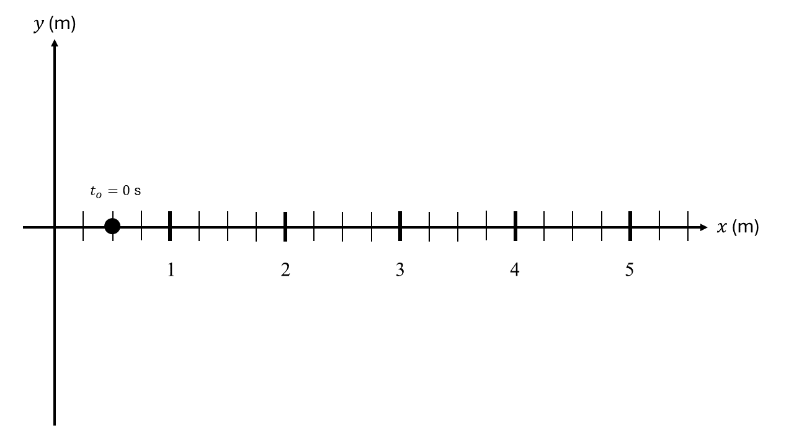
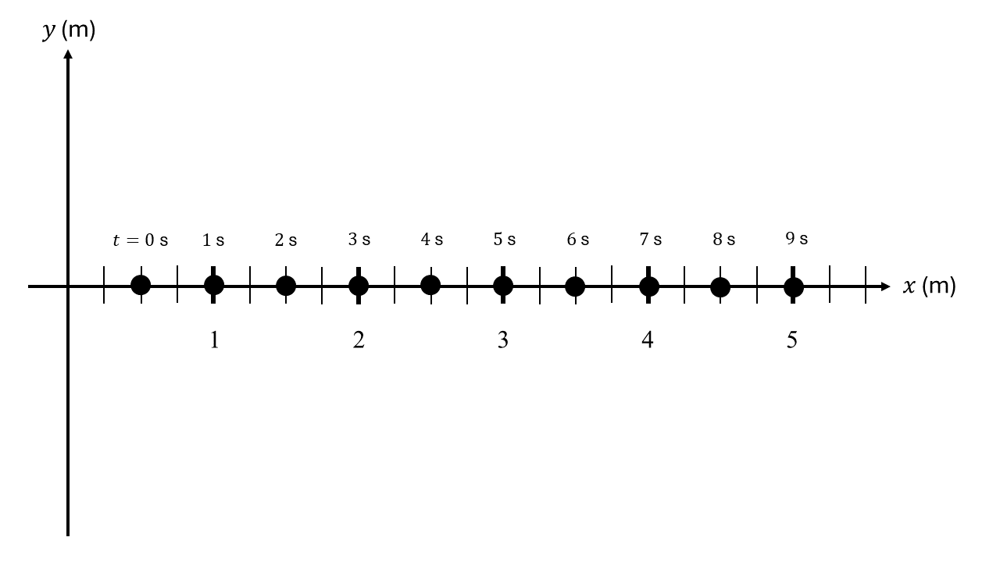

(chap:momentumandcm)=
# Overview

In this chapter, we introduce the concepts of linear momentum and of centre of mass. Momentum is a quantity that, like energy, can be defined from Newton's Second Law, to facilitate building models. Since momentum is often a conserved quantity within a system, it can make calculations much easier than using forces. The concepts of momentum and of centre of mass will also allow us to apply Newton's Second Law to systems comprised of multiple particles including solid objects. 

:::{hint} LearningObjectives
* Understand the relationship between constant momentum and Newton's First Law
* Understand how to calculate linear momentum.
* Understand how to calculate impulse and that it corresponds to a change in momentum.
* Understand when and how to apply conservation of linear momentum to model situations.
* Understand the difference between elastic and inelastic collisions, and when mechanical energy is conserved.
* Understand how to calculate the centre of mass of an object.
:::

:::{note} Think About It
You hit a pool ball square on with the cue ball. If both balls have the same mass, and you can neglect any "english" on the cue ball, what happens to the cue ball?
1.  It stops.
2.  It continues, with half of its original speed.
3.  It continues, with its original speed.
4.  It rebounds, with its original speed.
:::{note} Answer
:class: dropdown
1.
:::

:::{caution} Review
Throughout this chapter there are discussions of kinetic energy. [Chapter 7](#chap:workenergy) is when we will discuss kinetic energy in detail. Feel free to read ahead. However, it is enough to know that kinetic energy is the energy of motion and is a conserved quantity in some scenarios. We describe kinetic energy with the equation 
```{math}
K=\frac{1}{2} mv^2
```
where $m$ is the mass of an object moving with speed $v$.
:::
# Momentum and Newton's First Law
Momentum is a quantity that describes an object's motion. Imagine an object that has a mass of 1 kg and a velocity of 1 m/s. Now, imagine doubling the mass and keeping the velocity constant. How would you say the object's motion has changed? It may help to think of the quantity of motion as "oomph". Does a more massive object have more or less oomph than a less massive object when they both move at the same speed? What if the 1 kg object doubles its speed? Does it have more oomph?

In 1687, Sir Isaac Newton published his Philosophiae Naturalis Principia Mathematica, where, among other things, he detailed his three laws of motion. The first law is summarized as

> An object will remain in its state of motion, be it at rest or moving with constant velocity, unless a net external force is exerted on the object.

In perhaps simpler terms, this says that an object's oomph or **momentum** will remain a constant quantity if nothing pushes or pulls on it.

## Momentum of a point particle
We can define the momentum, $\vec p$, of a particle of mass $m$ and velocity $\vec v$ as the vector quantity:
% boxed equation
```{math}
\vec p = m\vec v
```
Since this is a vector equation, it corresponds to three equations, one for each component of the momentum vector, which are defined by the velocity in each of the three dimensions. It should be noted that the numerical value for the momentum of a particle is arbitrary, as it depends in which frame of reference the velocity of the particle is defined. For example, your velocity with respect to the surface of the Earth may be zero, and so your momentum relative to the surface of the Earth is zero. However, relative to the surface of the Sun, your velocity, and momentum, are not zero. As we will see, forces are related to a *changes* in momentum, just as they are related to a change in velocity (acceleration).

Consider a point particle[^5] moving at constant velocity such as a rock sliding across a frozen pond. If we capture an image of the rock at the same time we start a stopwatch ($t_o = 0 {\rm s}$), it might be located at a position 0.5 meters from the shore as shown in [](#fig:momentumandcm:constvelmotiona). We will designate the direction the rock slides as being along the $x$-axis.
:::{figure} 
:label: fig:momentumandcm:constvelmotion
:align: center

(fig:momentumandcm:constvelmotiona)=


(fig:momentumandcm:constvelmotionb)=


The motion diagram of a rock sliding across a frozen pond. 
:::
As time progresses, the rock will be at greater and greater distances from the shore. As shown in [](#fig:momentumandcm:constvelmotionb), the rock slides 0.5 meters every second. Suppose we recorded its $x$-position every second in a table and obtained the values in [](#tab:MomentumAndCM:1dmotion) (we will ignore measurement uncertainties discussed in [Section %s](#sec:ModelAndExperiment:uncertainties) and pretend that the values are exact).
```{table} Time and $x$-position of a rock sliding across a frozen pond recorded every second.
:label: tab:MomentumAndCM:1dmotion
| Time $t$ (s) | $x$-position (m) |
| :----------: | :--------------: |
|     0.0      |       0.5        |
|     1.0      |       1.0        |
|     2.0      |       1.5        |
|     3.0      |       2.0        |
|     4.0      |       2.5        |
|     5.0      |       3.0        |
|     6.0      |       3.5        |
|     7.0      |       4.0        |
|     8.0      |       4.5        |
|     9.0      |       5.0        |
```
The easiest way to visualize the values in the table is to plot them on a graph, as in [](#fig:MomentumAndCM:1dxvst). Plotting position as a function of time is one of the most common graphs to make in physics, since it is often a complete description of the motion of an object. 
```{figure} ./figures/MomentumAndCM/1dxvst.png
:width: 70%
:label: fig:MomentumAndCM:1dxvst
:align: center
:alt: Plot of position as a function of time using the values from [](#tab:MomentumAndCM:1dmotion).
Plot of position as a function of time using the values from [](#tab:MomentumAndCM:1dmotion).
```
The data plotted in [](#fig:MomentumAndCM:1dxvst) show that the $x$ position of the rock increases linearly with time (i.e. it is a straight line and the position increases at a constant rate). This means that in equal time increments, the rock will cover equal distances. Note that we also had the liberty to choose when we define $t=0$; in this case, we chose that time is zero when the rock is at $x=0.5 {\rm m}$. 

:::{tip} Checkpoint
Using the data from [](#tab:MomentumAndCM:1dmotion), at what position along the $x$-axis will the rock be when time is $t=9.5 {\rm s}$, if it continues its motion undisturbed?
1. $5.0 {\rm m}$
2. $5.25 {\rm m}$
3. $5.75 {\rm m}$
4. $6.0 {\rm m}$
:::{tip} Answer
:class: dropdown
2.
:::
:::{tip} Checkpoint
If we were to graph the velocity vs. time, the graph is
1. a straight line with positive slope.
2. a horizontal line with zero slope.
3. a straight line with negative slope.
:::{tip} Answer
:class: dropdown
2.
:::
Since the position as a function of time for the ball plotted in [](#fig:MomentumAndCM:1dxvst) is linear, we can summarize our description of the motion using a function, $x(t)$, instead of having to tabulate the values as we did in Table [](#tab:MomentumAndCM:1dmotion). The function will have the functional form:
% boxed equation
```{math}
:label: eqn:MomentumAndCM:1dxvst_noa
x(t) = x_o + v_x t
```
The constant $x_o$ is the "offset" of the function; the value that the function has at $t= 0 {\rm s}$. We call $x_o$ the "initial position" of the object (its position at $t=0$). The constant $v_x$ is the "slope" of the function and gives the rate of change of the position as a function of time. We call $v_x$ the "velocity" of the object.

The initial position is simply the value of the position at $t=0$, and is given from the table as:
```{math}
x_o = 0.5 {\rm m}
```

The velocity, $v_x$, is simply the difference in position, $\Delta x=x_f-x_o$, between any final, $x_f$, and initial, $x_o$, positions divided by the amount of time, $\Delta t=t_f-t_o$, that it took the object to move between those two points ("rise over run" for the graph of $x(t)$):

```{math}
:label: eqn:momentumandcm:constveleq
\vec v = \frac{\Delta \vec x}{\Delta t}\xrightarrow[\Delta t \to 0]{}\frac{d\vec x}{dt}
```
where the arrow indicates the limit as the changes become very small. For the rock in one dimension as it moves from 0.5 m to 1.0 m over the duration of 1 second,
```{math}
\vec v &= \frac{x_f-x_o {\rm m}}{t_f-t_o {\rm s}} \hat x \\
\vec v &= \frac{1.0-0.5 {\rm m}}{1-0 {\rm s}} \hat x \\
\vec v &= \frac{0.5 {\rm m}}{1 {\rm s}} \hat x \\
\vec v &= \left(0.5, 0, 0\right) {\rm m/s}
```
Therefore, the rock has a velocity of 0.5 m/s along the $x$-direction. We arbitrarily chose the change in position over the first second. However, with constant velocity, one could choose any time interval and the corresponding change in position to obtain the same constant velocity.

Rearranging the first line of equation {eq}`eqn:momentumandcm:constveleq` we see that the rock moves a small increment $\Delta x$ each increment of time $\Delta t$
```{math}
\Delta x = v\Delta t
```
Therefore, we can think of the position equation {eq}`eqn:MomentumAndCM:1dxvst_noa` as
```{math}
:label: eqn:MomentumAndCM:1dxvst_noa2
x(t) &= x_o+ \Delta x \\
x(t) &= x_o + v\Delta t\\
x(t) &= x_o + vt
```
We often use $t$ for $\Delta t$ to indicate some total amount of time has passed since our initial position was recorded. As long as the velocity is constant, we can use equation {eq}`eqn:MomentumAndCM:1dxvst_noa` to determine the position of an object between any two points in time. In one dimension, the vector quantity of velocity indicates the speed of an object along a single coordinate direction. The vector can be positive (along the $+x$-direction) or negative (along the $-x$-direction).
:::{note} Example 4.1
In [](#fig:MomentumAndCM:motion1D), an object moves for ten seconds with varying velocities. Describe the motion vs. time. Make sure to include direction of the motion and state your answers as vectors.
```{figure} ./figures/MomentumAndCM/motionDiagram.png
:width: 100%
:label: fig:MomentumAndCM:motion1D
:align: center
:alt: Plot of position as a function of time for an object moving at varying velocities.
Plot of position as a function of time for an object moving at varying velocities.
```
:::{note} Solution
:class: dropdown
There are four different velocities, labeled a, b, c, d in [](#fig:MomentumAndCM:motion1DSoln). 
```{figure} ./figures/MomentumAndCM/motionDiagramSoln.png
:width: 100%
:label: fig:MomentumAndCM:motion1DSoln
:align: center
:alt: Plot of position as a function of time for an object moving at varying velocities, labeled a, b, c, d.
Plot of position as a function of time for an object moving at varying velocities, labeled a, b, c, d.
```
* During interval **a** from $t = 0$ to $t = 2$ seconds, the object moves from $x = 0$ to $x = 6$ meters, for a positive velocity in the $x$-direction of $\vec{v} = (6-0)/(2-0)\hat{x} = (3.00, 0, 0) {\rm m/s}$. 
* During interval **b** from $t = 2$ to $t = 5$ seconds, the object moves from $x = 6$ to $x = 6$ meters, for a zero velocity (motionless) in the $x$-direction of $\vec{v} = (6-6)/(5-2) \hat{x} = (0, 0, 0) {\rm m/s}$.
* During interval **c** from $t = 5$ to $t = 6$ seconds, the object moves from $x = 6$ to $x = 2$ meters, for a negative velocity in the $x$-direction of $\vec{v} = (2-6)/(5-2) \hat{x} = (-1.33, 0, 0){\rm m/s}$.
* During interval **d** from $t = 6$ to $t = 10$ seconds, the object returns to its starting position, moving from $x = 2$ to $x = 0$ meters, for a negative velocity in the $x$-direction of $\vec{v} = (2-0)/(10-6) = (-0.50, 0, 0) {\rm m/s}$.
:::
### Simulating the rock
:::{caution} Review
Before proceeding, you may wish to review:
* [Appendix %s](#app:visualpython) for an introduction to programming with Visual Python using trinket.io.
:::
Under constant velocity motion we can describe a future position of an object using the current position, the velocity, and an increment of time to progress into the future. With equation {eq}`eqn:MomentumAndCM:1dxvst_noa`, we can model this motion on computer. We will use the Python language in this textbook, and in particular, we will use Visual Python so that we can apply physics to objects that visualize physical motion in 3D. To get started, we first need to define an object that will move through space. We will make a sphere call it ```rock```. The ```rock``` object can beplaced at a position using a vector ```pos=vec(x,y,z)```.
```python
rock = sphere(pos=vec(0,0,0), color=color.green, radius=0.1)
```
We can define the velocity to be a vector along the x-direction also using the built-in vector function ```velocity=vec(vx, vy, vz)```. To set the velocity to the appropriate vector, it would be coded
``` python
velocity = vec(0.5, 0, 0)
```
Alternatively, it is possible to make the velocity one of the attributes of the rock object. We should be careful to only use this method when the attribute is a property of the object, e.g.,
``` python
rock.vel = vec(0.5, 0, 0)
```
We can visualize the velocity with a vector arrow that remains attached to the rock's position and has a length that is the magnitude of the velocity. To do this we write the following code.
``` python
arr = arrow(pos=rock.pos, axis=rock.vel, color=color.white)
```
Try, putting these three lines of code in the trinket below and see what happens when you run the program.
:::{iframe} https://trinket.io/embed/glowscript/8f1815879d?toggleCode=true
:label: chap:momentumandcm:blanktrinket
:width: 90%
:align: center
:placeholder: './chapters/figures/MomentumAndCM/BlankTrinket.jpg'
A blank trinket to simulate a rock sliding on a frozen pond.
:::

This code draws the rock and the velocity vector, but it does not simulate the motion. To simulate the motion, we need to update the position of the rock as time progresses. We can use a loop to repeat calculations of the position. For example, we can repeat the calculations `while` the time is less than 2 seconds. Each time the position is calculated, we will add a small increment of time for the next calculation. Here is an example where we start at time $t=0$ and increment the position every $\Delta t = 0.1 {\rm s}$.
```python
t = 0
delta_t = 0.1
while t<2:
	rate(10)
	rock.pos = rock.pos + rock.vel * delta_t #update the rock position
	arr.pos = rock.pos #update the velocity arrow position
	t = t + delta_t #increment the time
```
Try this code and see that the rock moves. A trail can be added to see where the rock was in the past. Add this line after the line of code where the rock is first defined.

```python
rock.make_trail=True
```
### Constant momentum in 2D and 3D
As mentioned previously, a momentum vector is a three-dimensional equation.
```{math}
m\vec v &= mv_x \hat x + mv_y \hat y + mv_z \hat z\\ 
m\vec v &= m\left( v_x \hat x + v_y \hat y + v_z \hat z\right)
```
The velocity vector can be written in differential form
```{math}
\vec v &= \frac{dx}{dt}\hat x + \frac{dy}{dt}\hat y + \frac{dz}{dt}\hat z\\
\vec v &= \left(\frac{dx}{dt},\frac{dy}{dt},\frac{dz}{dt}\right)
```
Additionally, the position of an object with constant velocity can be written as three kinematic equations corresponding to {eq}`eqn:MomentumAndCM:1dxvst_noa`.
```{math}
x(t) = x_o + v_xt\\
y(t) = y_o + v_yt\\
z(t) = z_o + v_zt\\
```
:::{note} Example 4.2
In [](#fig:MomentumAndCM:trainEx), two trains leave the same station at the same time. Train A with a mass of 500 000 kg travels 200 km east ($\hat{x}$) and then 100 km north ($\hat{y}$) at a constant speed of $v=100{\rm km/hr}$. Train B with a mass of 750 000 kg travels in a straight path at constant speed to the destination.
* a) Write the velocities for the two segments of Train A's trip.
* b) With what velocity must Train B travel to arrive at the destination at the same time as Train A?
* c) Which train has the larger momentum?
```{figure} ./figures/MomentumAndCM/trainEx4.2.png
:width: 100%
:label: fig:MomentumAndCM:trainEx
:align: center
:alt: Two trains leaving a common station at the same time traveling two different paths.
Two trains leaving a common station at the same time traveling two different paths.
```
:::{note} Solution
:class: dropdown
* a) The first segment of Train A's trip is along $\hat{x}$ at 100 km/hr. This can be written as a vector $\vec{v}=(100, 0, 0){\rm km/hr}$. The second segment is along $\hat{y}$ and can be written as a vector $\vec{v}=(0, 100, 0){\rm km/hr}$
* b) By Pythagorean Theorem, Train B travels
```{math}
\Delta r_B = \sqrt{200^2 + 100^2} = 223.6 {\rm km}
```
Train A travels a total of 300 km at a speed of 100 km/hr. The time it takes Train A to reach the destination is
```{math}
t = \frac{\Delta r_A}{v} = \frac{300}{100} = 3~{\rm hr}
```
Therefore, Train B must travel at a speed
```{math}
v_B = \frac{\Delta r_B}{t} = \frac{223.6}{3} = 74.5~{\rm km/hr}
```
This speed is in two dimensions where the angle is 
```{math}
\theta = \tan^{-1}\left(\frac{100}{200}\right) = 26.6^o
```
Using the speed and angle, we can write the vector velocity of Train B
```{math}
\vec{v_B} &= v_B\cos(\theta)\hat{x} + v_B\sin(\theta)\hat{y}\\
\vec{v_B} &= 74.5\cos(26.6^o)\hat{x} + 74.5\sin(26.6^o)\hat{y}\\
\vec{v_B} &= 66.6\hat{x} + 33.3\hat{y}~{\rm km/hr}\\
\vec{v_B} &= (66.6, 33.3, 0)~{\rm km/hr}
```
* c) Train A has momentum 
```{math}
p_A = m_Av_A = 500000(100) = 5.00\times 10^7{\rm kg\cdot km/hr}
```
Train B has momentum 
```{math}
p_B = m_Bv_B = 750000(74.5) = 5.59\times 10^7{\rm kg\cdot km/hr}
```
Therefore, Train B has more momentum.
:::

# Non-constant Momentum and Newton's 2nd Law
If the particle has a constant mass, and its momentum changes with time, then the time dependence of its momentum is given by:
```{math}
\frac{\Delta \vec p}{\Delta t} = m\frac{\Delta \vec v}{\Delta t}
```
We define a velocity changing with time as **acceleration**.
```{math}
\vec a = \frac{\Delta \vec v}{\Delta t}\xrightarrow[\Delta t \to 0]{}\frac{d\vec v}{dt}
```
where the arrow indicates the limit as the changes become very small. Just as we did with constant velocity and position, we can write kinematic equations of motion for velocity by applying the definition of acceleration.
```{math}
:label: eqn:MomentumAndCM:nonConstv
v(t) &= v_o + \Delta v \\
v(t) &= v_o + a\Delta t\\
v(t) &= v_o + at
```
With constant acceleration, we can use graphical analysis to determine equations describing velocity and position as a function of time. In [](#fig:MomentumAndCM:graphkinematics)(a), a graph of constant acceleration is shown. Since acceleration is a change in velocity over time, we know that multiplying an acceleration by time gives a change in velocity. See {eq}`eqn:MomentumAndCM:nonConstv`. Notice that this change in velocity is the same as the area of the acceleration vs. time graph. The change in velocity is, of course, added to any pre-existing velocity an object has. This is depicted in [](#fig:MomentumAndCM:graphkinematics)(b) as a blue shaded triangle. Since a change in position comes from velocity and changes in velocity, we can apply the same analysis to the velocity vs. time graph to obtain an expression for position vs. time. For constant motion (no acceleration), the position changes as the red shaded area of [](#fig:MomentumAndCM:graphkinematics)(b), which has an area $\Delta x = v_ot$. This results in {eq}`eqn:MomentumAndCM:1dxvst_noa2` and is shown in [](#fig:MomentumAndCM:graphkinematics)(c) as a red straight line. We would expect a linear form after seeing this for velocity with constant acceleration. To analyze motion with constant acceleration, we must add both the red rectangular and the blue triangular areas in [](#fig:MomentumAndCM:graphkinematics)(b). The rectangular area again has area $v_ot$. The triangular area is $1/2 (v_f-v_o) t=1/2\Delta v t= 1/2at^2$. Adding these together, one obtains the set of kinematic equations
```{math}
x(t) &= x_o + v_o t + \frac{1}{2}at^2\\
v(t) &= v_o + at\\
a(t) &= a
``` 
We see that accelerated motion results in quadratic position vs. time.
```{figure} ./figures/MomentumAndCM/graphkinematics.png
:width: 70%
:label: fig:MomentumAndCM:graphkinematics
:align: center
:alt: Graphs depicting (a) constant acceleration, (b) constant and accelerated velocity, and (c) position that is constant, changing due to constant velocity, and changing due to constant acceleration.
Graphs depicting (a) constant acceleration, (b) constant and accelerated velocity, and (c) position that is constant, changing due to constant velocity, and changing due to constant acceleration.
```


If we assume the acceleration is constant with time, we can use integral calculus to determine equations describing position vs. time.
```{math}
x(t) &= \int v(t) dt\\
x(t) &= \int \left(v_0 + at\right) dt\\
x(t) &= x_o + v_o t + \frac{1}{2}at^2
```
:::{note} Example 4.3
A more realistic rock sliding on a frozen pond more is when the rock decelerates due to friction. If the rock has an initial velocity of $v_o=0.5~{\rm m/s}$ and slides for $t = 10~{\rm s}$ before coming to rest ($v(10{\rm s}) = 0~{\rm ms/s}$).
* a) What is the acceleration of the rock?
* b) What distance does the rock slide?
* c) Create graphs of position vs. time and velocity vs. time similar to [](#fig:MomentumAndCM:1dxvst).
::: {note} Solution 4.3
:class: dropdown
* a) We can use the kinematic equation for velocity as a function of time {eq}`eqn:MomentumAndCM:nonConstv`. This is one dimensional, and we only need to solve for the $x$-direction. We'll, therefore, ignore the vectors. 
```{math}
v(t) &= v_o + at\\
0 &= 0.5 + a\cdot 10\\
a &= \frac{-0.5}{10}\\
a &= -0.05~{\rm m/s^2}
```
Notice the acceleration is negative, indicating it is in the opposite direction of the initial velocity. This means the acceleration slows the rock.
* b) Now, we can use the acceleration to solve for the final position of the rock at $t=5~{\rm s}$.
```{math}
x(t) &= x_o + v_o t+ \frac{1}{2}at^2\\
x(10{\rm s}) &= 0.5 + 0.5\cdot 10 + \frac{1}{2}(-0.05)\cdot 10^2\\
x(10{\rm s}) &= 0.5 + 5 - 2.5\\
x(10{\rm s}) &= 3~{\rm m}
```
Without friction, the rock slid 5 meters over 10 seconds and would have continued to slide at the same rate. Now, with friction, we see that the rock travels 3 meters over 10 seconds and stops sliding. 
* c) Using the same time intervals as [](#tab:MomentumAndCM:1dmotion), we can use the equations from part a) and b) to calculate velocity and position at each time.
```{table} Time, $x$-position, and velocity $v_x(t)$ of a decelerating rock sliding across a frozen pond recorded every second.
:label: tab:MomentumAndCM:nonconstEx4.3
| Time $t$ (s) | $x$-position (m) | $v_x$ (m/s) |
| :----------: | :--------------: | :---------: |
|     0.0      |       0.500      |    0.50     |
|     1.0      |       0.975      |    0.45     |
|     2.0      |       1.400      |    0.40     |
|     3.0      |       1.775      |    0.35     |
|     4.0      |       2.100      |    0.30     |
|     5.0      |       2.375      |    0.25     |
|     6.0      |       2.600      |    0.20     |
|     7.0      |       2.600      |    0.15     |
|     8.0      |       2.775      |    0.10     |
|     9.0      |       2.975      |    0.05     |
|    10.0      |       3.000      |    0.00     |
```
```{figure} ./figures/MomentumAndCM/velVst_Ex4.3.png
:width: 70%
:label: fig:MomentumAndCM:velVstEx4.3
:align: center
:alt: Velocity vs. time for a rock sliding with friction decelerating the rock.
Velocity vs. time for a rock sliding with friction decelerating the rock.
```
```{figure} ./figures/MomentumAndCM/posVst_Ex4.3.png
:width: 70%
:label: fig:MomentumAndCM:posVstEx4.3
:align: center
:alt: Position vs. time for a rock sliding with friction decelerating the rock.
Position vs. time for a rock sliding with friction decelerating the rock.
```
:::

:::{attention} Valéria's Thoughts
When there is constant acceleration, the graph of position vs. time changes from a linear dependence with time to a quadratic dependence with time. In the case of negative acceleration, the position *may be* increasing, but the *change* in position is decreasing with each second that passes. The corresponding velocity is linear with time and has a negative slope because the velocity is decreasing with time. Eventually, the object slows to a stop. Its velocity is zero, and its position remains constant. If the acceleration exists only while the object is moving, as is the case with friction, the object will remain at rest. It may be possible that there are accelerations that do not cease to influence an object's motion when it comes to rest. If this were true, the object would accelerate with increasing velocity in the opposite direction of its initial velocity after coming to rest.
:::

We can summarize interactions that result in momentum changes
```{math}
\frac{d}{dt}\vec p = \frac{d}{dt}m\vec v = m\frac{d}{dt}\vec v=m\vec a
```
keeping in mind that these changes over time correspond to changes in the kinematic description of an object's motion. This description of momentum changes leads us to the second of Newton's Laws of Motion.

> An object's acceleration is proportional to the net force exerted **on the object**, inversely proportional to the mass of the object, and in the same direction as the net force exerted on the object.

We can write the change in momentum as Newton's Second Law, since $m\vec a$ must be equal to the vector sum of the forces on the particle of mass $m$:
% boxed equation
```{math}
\frac{d}{dt}\vec p = \sum \vec F = \vec F^{net}
```
The equation above is the original form in which Newton first developed his theory. It says that the net force on an object is equal to the rate of change of its momentum. **If the net force on the object is zero, then its momentum is constant** (as is its velocity). In terms of components, Newton's Second Law written for the rate of change of momentum is given by:
```{math}
\frac{dp_x}{dt} =& \sum F_x\\
\frac{dp_y}{dt} =& \sum F_y\\
\frac{dp_z}{dt} =& \sum F_z
```

:::{note} Example 4.4
A particle of mass $m$ is released from rest and allowed to fall freely under the influence of gravity near the Earth's surface (assume that drag from air resistance is negligible). Acceleration due to gravity near the Earth's surface is $\vec a = \vec g = -9.8~{\rm m/s^2} \hat z$, where the negative sign indicates "downward" relative to the $z$-direction defined as "upward". Is the momentum of the particle conserved? If momentum is not conserved, how does momentum of the particle change with time? Do your answers change if the force of drag cannot be ignored?}
:::{note} Solution
:class: dropdown
First, we model the falling particle assuming that there is no force of drag. The only force exerted on the particle is thus its weight. 

The mechanical energy of the particle will be conserved only if there are no non-conservative forces doing work on the particle. Since the force of gravity is the only force acting on the particle, its mechanical energy is conserved.

The total momentum of the particle is not conserved, because the sum of the forces on the particle is not zero. Choosing the $z$ axis to be vertical and positive upwards, Newton's Second Law in the $z$ direction is given by:
```{math}
\sum F_z = -mg=\frac{dp_z}{dt}
```
Note that the $x$ and $y$ components of momentum are conserved, since there are no forces with components in that direction. We can find how the $z$ component of the momentum changes with time by taking the anti-derivative of the force with respect to time (from $t=0$ to $t=T$):
```{math}
\frac{dp_z}{dt} &= -mg\\
dp_z &= -mg dt\\
```
As long as the force does not depend on time (true for gravity near the Earth's surface), we can simply add up the total time that passes, which corresponds to a total change in momentum.
```{math}
dp_z &= -mg dt\\
\Delta p_z &= -mg \Delta t
```
Furthermore, if the initial time is zero ($t_o=0~{\rm s}$, and the initial momentum is zero ($p(t=0)=0$), we can write this result as
```{math}
p_z(T) &= -mgT\\
```
If the initial momentum is not zero, the $z$ component of momentum, $p_z(T)$ at some time $T$, is given by its value at time $t=0$ ($p_o$) plus $-mgT$. If the object started at rest ($\vec v=0$), then the magnitude of the momentum, as a function of time, is given by:
```{math}
p(t) = p_z(t) = -mgt
```
and indeed changes with time.

If the force of drag were not negligible, there would be a non-conservative force acting on the particle, so its mechanical energy would no longer be conserved (We will see more about this in [Chapter 7](#chap:workenergy) and [Chapter 8](#chapter:potentialecons). The particle will accelerate until it reaches terminal velocity. During that phase of acceleration, the net force on the particle is not zero (it is accelerating), so its momentum is not conserved. Once the particle reaches terminal velocity, the net force on the particle is zero, and its momentum is conserved from then on.

**Discussion:** This simple example highlights the fact that mechanical energy and momentum are conserved under different conditions. Just because one is conserved does not mean that the other is conserved. It also shows that Newton's Second Law is a statement about change in momentum, not momentum itself (just like it is a statement about acceleration, change in velocity, not velocity).
:::

## Impulse
Forces are a concept central to physics and are related the concept of energy. We'll see in [Chapter 7](#chap:workenergy) that we calculate the "work", $W$, done by a force exerted on an object over a specific path between two points:
```{math}
W = \int_A^B \vec F \cdot d\vec l
```
This, then, introduces the concept of kinetic energy, $K$, to be that quantity whose change is equal to the net work done on the particle
```{math}
W^{net} = \int_A^B \vec F^{net}\cdot d\vec l = \Delta K
```
where the net force, $\vec F^{net}$, is the vector sum of the forces on the particle.

We can do the same thing, but instead of integrating the force over distance, we can integrate it over time. We thus introduce the concept of "impulse", $\vec J$, of a force, as that force integrated from an initial time, $t_A$, to a final time, $t_B$:
```{math}
\vec J = \int_{t_A}^{t_B}\vec F dt
```
where it should be clear that impulse is a vector quantity (and the above vector equation thus corresponds to one integral per component). Impulse is, in general, defined as an integral because the force, $\vec F$, could change with time. If the force is constant in time (magnitude and direction), then we can define the impulse without using an integral:
```{math}
\vec J = \vec F \Delta t
```
where $\Delta t$ is the amount of time over which the force was exerted. Although the force might never be constant, we can sometimes use the above formula to calculate impulse using an average value of the force.

:::{tip} Checkpoint
What is the SI unit for impulse?
1.  ${\rm kg\cdot m/s^2}$
2.  ${\rm kg \cdot s^2}$
3.  ${\rm kg \cdot m/s}$
4.  ${\rm kg \cdot m/s^3}$
:::{tip} Answer
:class: dropdown
3.
:::

:::{note} Example 4.5
Estimate the impulse that is given to someone's hand when they swat a fly on the surface of a table.
:::{note} Solution
:class: dropdown
When we swat a fly with our hand, our hand exerts a force on the table surface during the period of time, $\Delta t$, over which our hand is in contact with the table surface. During that period of time, the force on the hand goes from being 0, to some unpleasantly high value, and then back to zero, so the force cannot be considered constant. 

Let us estimate the average magnitude of the swatting force by considering the deceleration of our swatting hand and modelling the motion as one-dimensional. Let us assume that our swatting hand has a mass $m=1 {\rm kg}$ and that it is has a speed of $2 {\rm m/s}$ just before it makes contact. Furthermore, let us assume that it is in contact with the table for a period of time $\Delta t$. This allows us to find the average acceleration of our hand and thus the average force exerted by the table on our hand to stop it:
```{math}
a &= \frac{\Delta v}{\Delta t}\\
\therefore F &= ma = m  \frac{\Delta v}{\Delta t}
```
By Newton's Third Law, the force decelerating our hand has the same magnitude as the force that our hand exerts on the table, allowing us to calculate the impulse given to the person's hand:
```{math}
J &= F\Delta t =  \left(m  \frac{\Delta v}{\Delta t}\right) \Delta t = m\Delta v\\
&=(1 {\rm kg})(2 {\rm m/s})=2 {\rm kg\cdot m/s}
```
**Discussion:** Note that the impulse given to the table corresponds exactly to the change in momentum of the hand ($\Delta p=m\Delta v$).
:::

So far, we calculated the impulse that is given by a single force. We can also consider the net impulse given to an object by the net force exerted on the object:
```{math}
\vec J^{net} = \int_{t_A}^{t_B}\vec F^{net} dt
```
Compare this to Newton's Second Law written out using momentum:
```{math}
\frac{d}{dt}\vec p &= \vec F^{net}\\
\int_{\vec p_A}^{\vec p_B} d\vec p &=  \int_{t_A}^{t_B}\vec F^{net} dt\\
\vec p_B - \vec p_A &=  \int_{t_A}^{t_B}\vec F^{net}dt\\
\therefore \Delta \vec p &= \int_{t_A}^{t_B}\vec F^{net}	 dt
```
and we find that the net impulse received by a particle is precisely equal to its change in momentum:
% boxed equation
```{math}
\Delta \vec p = \vec J^{net}
```
This is similar to the statement that the net work done on an object corresponds to its change in kinetic energy, although one should keep in mind that momentum is a vector quantity, unlike kinetic energy.

:::{note} Example 4.6
A car moving with a speed of $100 {\rm km/h}$ collides with a building and comes to a complete stop. The driver and passenger each have a mass of $80 {\rm kg}$. The driver wore a seat belt that extended during the collision, so that the force exerted by the seatbelt on the driver acted for about $2.5 {\rm s}$. The passenger did not wear a seat belt and instead was slowed down by the force exerted by the dashboard, over a much smaller amount of time, $0.2 {\rm s}$. Compare the average decelerating force experienced by the driver and the passenger.
:::{note} Solution
:class: dropdown
We can calculate the change in momentum of both people, which will be equal to the impulse they received as they collided with the seatbelt or with the dashboard. Since we know the duration in time that the forces were exerted, we can calculate the average force involved in order to give the required impulse. We can assume that this all happens in one dimension, so we use scalar quantities instead of vectors.

The change in momentum along the direction of motion for either the driver or passenger is given by:
```{math}
\Delta p = p_B - p_A = (0)-p_A=-mv_A
```
where $v_A$ is the initial speed of the car, and the final momentum of either person is zero. 

The change in momentum is equal to the impulse received by either person during a period of time $\Delta t$, which is related to the force that was exerted on them:
```{math}
J=F\Delta t &= \Delta p = -mv_A\\
F&=-m \frac{v_A}{\Delta t}
```
For the driver, this corresponds:
```{math}
F=(80 {\rm kg})\frac{(27.8 {\rm m/s})}{(2.5 {\rm s})}=890 {\rm N}
```
and for the passenger:
```{math}
F=(80 {\rm kg})\frac{(27.8 {\rm m/s})}{(0.2 {\rm s})}=11120 {\rm N}
```
The force on the driver is thus comparable to their weight, whereas the passenger experiences an average force that is more than 10 times their weight.

**Discussion:** Any mechanism that results in a longer collision time will help to reduce the forces that are involved. This is why cars are designed to crumple in head-on collisions. We can understand this in terms of the crumpling of the car absorbing some of the kinetic energy of the car, as well as lengthening the time of the collision so that the forces involved are smaller. You may also hear people that look at modern cars that are all crumpled up after a crash and say something along the lines of "They sure don't make cars the way they used to". But of course, that is by design; it is safer if the car crumples up (and cars are designed to crumple up in specific areas, not the passenger cabin).

Note that we did not need to use impulse to calculate the average force, since we could have just used kinematics to determine the acceleration and Newton's Second Law to calculate the corresponding force. Using impulse is equivalent by construction, but sometimes, it is easier mathematically.
:::


## Systems of particles: internal and external forces
So far, we have only used Newton's Second Law to describe the motion of a single point mass particle or to describe the motion of an object whose orientation we did not need to describe (e.g. a block sliding down a hill). In this section, we consider what happens when there are multiple point particles that form a "system".

In physics, we loosely define a system as the ensemble of objects/particles that we wish to describe. So far, we have only described systems made of one particle, so describing the motion of the system was equivalent to describing the motion of that single particle. A  system of two particles could be, for example, two billiard balls on a pool table. To describe that system, we would need to provide functions that describe the positions, velocities, and forces exerted on both balls. We can also define functions/quantities that describe the system as a whole, rather than the details. For example, we can define the total kinetic energy of the system, $K$, corresponding to the sum of kinetic energies of the two balls. We can also define the total momentum of the system, $\vec P$, given by the vector sum of the momenta of the two balls.

When considering a system of multiple particles, we distinguish between **internal** and **external** forces. Internal forces are those forces that the particles in the system exert on each other. For example, if the two billiard balls in the system collide with each other, they will each exert a force on the other during the collision; those forces are internal. External forces are all other forces exerted on the particles of the system. For example, the force of gravity and the normal force from the pool table are both external forces exerted on the balls in the system (exerted by the Earth, or by the pool table, neither of which we considered to be part of the system). The force exerted by a person hitting one of the balls with a pool queue is similarly an external force. What we consider to be a system is arbitrary; we could consider the pool table and the Earth to be part of the system along with the two balls; in that case, the normal force and the weight of the balls would become internal forces. The classification of whether a force is internal or external to a system of course depends on what is considered part of the system.

:::{tip} Checkpoint
Two billiard balls crash against each other. We consider the system to be the two billiard balls only. Is this collisional force exerted by one ball on the other an internal or external force?
1.  Internal. 
2.  External.
:::{tip} Answer
:class: dropdown
1.
:::

The key property of internal forces is that **the vector sum of the internal forces in a system is zero**. This brings us to Newton's Third Law of Motion. Newton's Third Law states that for every force exerted by object A on object B, there is a force that is equal in magnitude and opposite in direction exerted by object B on object A. If we consider both objects to be in the same system, then the sum of the internal forces between objects A and B must sum to zero. It is important to note that this is quite different than what we have discussed so far about summing forces. The forces that sum to zero are exerted on *different* objects. Thus far, we had only ever considered summing forces that are exerted on the same object in order to apply Newton's Second Law. We have never encountered a situation where "action" and "reaction" forces are summed together, because they act on different objects.

:::{attention} Farooq's Thoughts

**Internal vs. External forces - what is the "system" and what forces should we consider?**

As discussed above, internal and external forces can only be considered in the context of a specific system. So, how do we define this "system"? How far do we go when defining the system?

For example, let's say that you kick a soccer ball, and it hits a nearby lawn chair, knocking it down. You want to determine what will happen to the soccer ball after it hits the lawn chair. What is defined to be the system here, and how should the forces be classified? Is the force exerted by the soccer ball on the lawn chair an external force? Should we consider the friction between the first foot particle that touches the first soccer ball particle?

The best way to approach "defining the system" is to pin down exactly what you're trying to model. Here, specifically, you are trying to determine the velocity of the ball after it hits the lawn chair. In this situation, thinking about the friction between individual foot and soccer ball particles wouldn't help us to figure out the final velocity of the soccer ball. Rather, thinking of the soccer ball and lawn chair as two giant, continuous particles, colliding and exchanging energy would be helpful. In this situation, it would be useful to consider the "system" to be the soccer ball and lawn chair only.

 The force exerted by the soccer ball on the lawn chair would be an internal force, as this gives us information as to the final velocity of the soccer ball and is a force exchanged between the particles within the system. The force that gravity exerts on the lawn chair, normal force on the person's foot and the force exerted by the foot on the soccer ball are all forces that we would consider "external".

Remember - "internal" and "external" are not magical properties of a specific type of force. These definitions are made by us in the quest of building useful models.
:::

## Conservation of momentum
Consider a system of two particles with momenta $\vec p_1$ and $\vec p_2$.  Newton's Second Law must hold for each particle:
```{math}
\frac{d\vec p_1}{dt}&=\sum_k \vec F_{1k}\\
\frac{d\vec p_2}{dt}&=\sum_k \vec F_{2k}
```
where $F_{ik}$ is the $k$-th force that is acting on particle $i$.  We can sum these two equations together:
```{math}
\frac{d\vec p_1}{dt}+\frac{d\vec p_2}{dt} &= \sum_k \vec F_{1k} + \sum_k \vec F_{2k}
```
The quantity on the right is the sum of the forces exerted on particle 1 plus the sum of the forces exerted on particle 2. In other words, it is the sum of all of the forces exerted on all of the particles in the system, which we can write as a single sum. On the left hand side, we have the sum of the two time derivatives of the momenta, which is equal to the time-derivative of the sum of the momenta. We can thus re-write the equation as:
```{math}
\frac{d}{dt}(\vec p_1 + \vec p_2) = \sum \vec F
```
where, again, the sum on the right is the sum over all of the forces exerted on the system. Some of those forces are external (e.g. gravity exerted by Earth on the particles), whereas some of the forces are internal (e.g. a contact force between the two particles). We can separate the sum into a sum over all external forces ($\vec F^{ext}$) and a sum over internal forces ($\vec F^{int}$):
```{math}
\sum \vec F = \sum \vec F^{ext} + \sum \vec F^{int} 
```
The sum of the internal forces is zero:
```{math}
\sum \vec F^{int} = 0
```
because for every force that particle 1 exerts on particle 2, there will be an equal and opposite force exerted by particle 2 on particle 1. We thus have:
```{math}
\frac{d}{dt}(\vec p_1 + \vec p_2) = \sum \vec F^{ext}
```
Furthermore, if we introduce the "total momentum of the system", $\vec P=\vec p_1 + \vec p_2$, as the sum of the momenta of the individual particles, we find:
```{math}
\frac{d\vec P}{dt} &= \sum \vec F^{ext}
```
which is the equivalent of Newton's Second Law for a system where, $\vec P$, is the total momentum of the system, and the sum of the forces is only over external forces to the system.

Note that the derivation above easily extends to any number, $N$, of particles, even though we only did it with $N=2$. In general, for the "ith particle", with momentum $\vec p_i$, we can write Newton's Second Law:
```{math}
\frac{d\vec p_i}{dt}=\sum_k \vec F_{ik}
``` 
where the sum is over only those forces exerted on particle $i$. Summing the above equation for all $N$ particles in the system:
```{math}
\frac{d}{dt}\sum_i \vec p_i=\sum \vec F^{ext} + \sum \vec F^{int}
```
where the sum over internal forces will vanish for the same reason as above. Introducing the total momentum of the system, $\vec P$:
```{math}
\vec P = \sum_i \vec p_i\\
```
We can write an equation for the time-derivative of the total momentum of the system:
% boxed equation
```{math}
\frac{d\vec P}{dt} = \sum \vec F^{ext}
```
where the sum of the forces is the sum over all forces external to the system. Thus, **if there are no external forces on a system, then the total momentum of that system is conserved** (if the time-derivative of a quantity is zero then that quantity is constant).

We already argued in the previous section that we can make all forces internal if we choose our system to be large enough. If we make the system be the Universe, then there are no forces external to the Universe, and the total momentum of the Universe must be constant:
```{math}
\frac{d\vec P^{Universe}}{dt} &= \sum_{Universe} \vec F^{ext} = 0 \\
\therefore \vec P^{Universe}&=\text{constant}
```

In summary, we saw that:
* If no forces are exerted on a single particle, then the momentum of that particle is constant (conserved).
* In a system of particles, the total momentum of the system is conserved if there are no external forces on the system.
* If there are no non-conservative forces exerted on a particle, then that particle's mechanical energy is constant (conserved).
* In a system of multiple particles, the total mechanical energy of the system will be conserved if there are no non-conservative forces exerted on the system.
 
When we refer to a force being "exerted on a system", we mean exerted on one or more of the particles in the system. In particular, the sum of the work done by internal forces is not necessarily zero, so **energy and momentum are thus conserved under different conditions**.

:::{note} Example 4.7
```{figure} figures/MomentumAndCM/train.png
:label: fig:momentumandcm:train
:width: 80%
:align: center
:alt: A train with $N$ cars of mass $m$ about to collide with a car of mass $m$ that is at rest on the track.
A train with $N$ cars of mass $m$ about to collide with a car of mass $m$ that is at rest on the track.
``` 
Consider a train made of $N$ cars of equal mass $m$ that is travelling at constant speed $v$ along a straight piece of track where friction and drag are negligible, as depicted in [](#fig:momentumandcm:train). An empty car of mass $m$ was left at rest on the track in front of the train. The train collides with the empty car which stays attached to the front of the train. What is the speed of the train after the collision? Is the total mechanical energy, $E=1/2 mv^2$, of the system conserved?
:::{note} Solution
:class: dropdown
When the train collides with the car, it will exert a "collision" force on the car, and the car will exert an opposite force on the train. If we consider both of the train and the car as being part of the same system, then those collision forces will be internal, and the momentum of the system (train + car) will be conserved. The train and car both experience external forces from Earth's gravity and the normal force from the train tracks. However, those two sets of forces cancel each other out, since neither the train nor the car have any acceleration in the vertical direction (the sum of the forces on each object has no net vertical component). Thus, there are no net external forces on the car+train system, and the total momentum of the system is conserved through the collision.

We can model this system in one dimension (along the track), defining our $x$ axis. We choose the ground as a frame of reference, the positive direction parallel to the initial velocity of the train, and the origin to be located where the car initially starts. Before the collision, the $x$ component of the momenta of the train (mass $Nm$) and car (mass $m$) are:
```{math}
p_{train}&=Nmv\\
p_{car}&=0
```
After the collision, the car is attached to the train (and thus has the same speed, $v'$), so the momenta of the train and car after the collision are:
```{math}
p'_{train}&=Nmv'\\
p'_{car}&=mv'
```
where the primes $'$ denote quantities after the collision. Applying conservation of momentum to the system, the total momentum before and after the collision must be equal:
```{math}
p_{train}+p_{car}&=p'_{train}+p'_{car}\\
\therefore Nmv &= Nmv' +mv'\\
\therefore v' &=\frac{N}{N+1}v
```
and the speed of the train with the additional car attached is reduced by a factor $N/(N+1)$ compared to what it was before the collision.

We can check to see if the mechanical energy of the system is conserved, since we know the speeds of the train and car before and after the collision. Since all of the motion is horizontal, gravity and the normal force do no work on either the train or car, so their mechanical energy can be taken as their kinetic energy (their gravitational potential energy does not change after the collision). The total mechanical energy of the system, $E$, before the collision is the kinetic energy of the train:
```{math}
E= \frac{1}{2}Nmv^2
```
The total mechanical energy of the system, $E'$, after the collision is:
```{math}
E' &= \frac{1}{2}Nmv'^2 + \frac{1}{2}mv'^2 = \frac{1}{2}(N+1)mv'^2 \\
&=\frac{1}{2}(N+1)m \left( \frac{N}{N+1}v \right)^2\\
&=\frac{1}{2}m\frac{N^2}{N+1}v^2
```
and we see that $E'<E$, and thus that the total mechanical energy of the system is not conserved (it is reduced after the collision).

**Discussion: **We could have solved this problem by carefully modelling the force exerted by the car on the train during the collision, which would have allowed us to find the speed of the train after the collision using its acceleration. This would have required a detailed model for that force, which we do not have. However, by realizing that the train and car could be considered as a system with no net external forces exert on it, we were able to easily find the speed of the train after the collision using conservation of momentum.

We also found that mechanical energy was not conserved. This makes physical sense because, for the car to remain attached to the train, there presumably had to be some significant forces in play that "crushed" the car into the train. Some of the initial kinetic energy of the train was used to deform the train and the car during the collision. We can also think of deforming a material as giving it energy. Sometimes that energy is recoverable (e.g. compressing a spring), sometimes, it is not (e.g. crushing a car).

If the car and train were equipped with large springs to absorb the energy of the impact, the collision could have conserved mechanical energy, as the springs compress and then expand back. The speed of the car and train would then be different after the collision in this case (see [Example 4.7](#ex:momentumandcm:1delastic)). It is a feature of collisions where the two bodies remain attached to each other that mechanical energy is not conserved.
:::

# Collisions
In this section we go through a few examples of applying conservation of momentum to model collisions. Collisions can loosely be defined as events where the momenta of individual particles in a system are different before and after the event.

We distinguish between two types of collisions: **elastic** and **inelastic** collisions. Elastic collisions are those for which the total mechanical energy of the system is conserved during the collision (i.e. it is the same before and after the collision). Inelastic collisions are those for which the total mechanical energy of the system is not conserved. In either case, to model the system, one chooses to define the system such that there are no external forces on the system so that total momentum is conserved.

## Inelastic collisions
In this section, we give a few examples of modelling inelastic collisions. Inelastic collisions are usually easier to handle mathematically, because one only needs to consider conservation of momentum and does not use conservation of energy (which usually involves equations that are quadratic in the speeds because of the kinetic energy term). 
:::{note} Example 4.8
```{figure} figures/MomentumAndCM/skaters.png
:label: fig:momentumandcm:skaters
:width: 40%
:align: center
:alt: One skater pushing another on a frictionless horizontal surface.
One skater pushing another on a frictionless horizontal surface.
```
You (mass $m_s$) and your friend (mass $m_f$) face each other on ice skates on an ice surface that is slippery enough that friction can be considered negligible, as shown in [](#fig:momentumandcm:skaters). You shove your friend away from you so that he moves with velocity $\vec v_f$ away from you (the velocity is measured relative to the ice). Is the collision elastic? What is your speed relative to the ice after you shoved your friend?
:::{note} Solution
:class: dropdown
We can consider the system as being comprised of you and your friend. There are no net external forces on the system (gravity and normal forces cancel each other), so the momentum of the system will be conserved. 

The mechanical energy will not be conserved. You had to use chemical potential energy stored in your muscles to shove your friend. Thus, external energy (i.e. not mechanical energy from you or your friend) was injected into the system, and we should expect the total mechanical energy to be larger after the collision. 

Before the collision, both you and your friend have zero speed, and thus zero kinetic energy and zero momentum. After the collision, your friend has a velocity $\vec v_f$. We can use conservation of total momentum, $\vec P$, to determine your velocity, $\vec v_s$, after the collision. 
```{math}
\vec P &=\vec P'\\
0 &= m_s\vec v_s + m_f\vec v_f\\
\therefore \vec v_s &= -\frac{m_f}{m_s}\vec v_f
```
where primes ($'$) denote a quantity after the collision. We find that your velocity is in the opposite direction from that of your friend. Before the collision, the mechanical energy, $E$, of the system is zero (we can ignore gravitational potential energy, since everything is in the horizontal plane). After the collision, the mechanical energy, $E'$, is:
```{math}
E' = \frac{1}{2}m_sv_s^2+\frac{1}{2}m_fv_f^2
```
which is clearly bigger than the mechanical energy before the collision (i.e. 0), as we suspected it would be.

**Discussion:** We find that you recoil in the opposite direction, which makes sense. If you push your friend in one direction, Newton's Third Law says that your friend pushes you in the opposite direction. Your speed furthermore depends on the ratio of your friend's mass to yours. This also makes sense, because if you both feel the same force, the person with the smallest mass will have the highest speed; if your mass is higher than your friend's, then your speed after the collision will be smaller than your friend's.

We also saw that mechanical energy was not conserved. In terms of energy, we can explain this by saying that you burned up chemical potential energy stored in your muscles in order to shove your friend. Because we included both you and your friend in the system, the shove was an internal force and momentum is conserved. Of course, if we had considered only you as the system, then your momentum would not have been conserved during the collision. 

The type of collision that we described here is also sometimes called an "explosion". You can imagine all of the parts that make up a bomb as small particles. When the bomb explodes, chemical potential energy is converted into the kinetic energy of the bomb fragments. If you consider all of the particles/fragments of the bomb as a system, then the total momentum of all of the bomb fragments is conserved (and equal to zero if the bomb was initially at rest). Again, mechanical energy would not be conserved (and would increase) as the chemical potential energy is converted into mechanical energy.
:::

:::{note} Example 4.9
A proton of mass $m_p$ and initial velocity $\vec v_p$ collides inelastically with a nucleus of mass $m_N$ at rest, as shown in [](#fig:momentumandcm:protonnucleus). A coordinate system is set up as shown, such that the initial velocity of the proton is in the $x$ direction. After the collision, the proton's speed is measured to be $v'_p$ and its velocity vector is found to make an angle $\theta$ with the $x$ axis as shown. What is the velocity vector of the nucleus after the collision? Assume that the collision takes place in vacuum.
```{figure} figures/MomentumAndCM/protonnucleus.png
:label: fig:momentumandcm:protonnucleus
:width: 70%
:align: center
:alt: A proton of mass $m_p$ colliding inelastically with a nucleus of mass $m_N$.
A proton of mass $m_p$ colliding inelastically with a nucleus of mass $m_N$.
```
:::{note} Solution
:class: dropdown
As a system, we consider the proton and the nucleus together, so that the total momentum of the system is conserved during the collision, as no other external forces are exerted on the two particles (since they are in vacuum). Because momentum is a vector, each component of the total momentum, $\vec P$, is conserved during the collision:
```{math}
\vec P &= \vec P'\\
\therefore P_x &= P'_x\\
\therefore P_y &= P'_y
```
where, as usual, primes ($'$) denote quantities after the collision. After the collision, both particles will have velocity vectors that have $x$ and $y$ components. Let the velocity vector of the nucleus after the collision be $\vec v'_N$ and let $\phi$ be the angle that it makes with the $x$ axis, as shown in [](#fig:momentumandcm:protonnucleus). 

We can start by considering the conservation of the $x$ component of the total momentum. The initial and final momenta in the $x$ direction are given by:
```{math}
P_x &= m_p v_p\\
P'_x &= m_p v'_p\cos\theta + m_N v'_N\cos\phi\\
\therefore m_p v_p &= m_p v'_p\cos\theta + m_N v'_N\cos\phi
```
which gives us a first equation to determine the final velocity of the nucleus.

The $y$ component of the total momentum before the collision is zero since we chose the coordinate system such that the initial velocity of the proton is in the $x$ direction. The initial and final momenta in the $y$ direction are given by:
```{math}
P_y &= 0\\
P'_y &= m_p v'_p\sin\theta - m_N v'_N\sin\phi\\
\therefore m_p v'_p\sin\theta &= m_N v'_N\sin\phi
```
which gives us a second equation to solve for the velocity of the nucleus. With the two equations from momentum conservation, we can solve for the magnitude and direction of the velocity of the nucleus. From the $y$ component of momentum conservation, we can find an expression for the speed of the nucleus:
```{math}
m_p v'_p\sin\theta &= m_N v'_N\sin\phi\\
\therefore v'_N &= \frac{m_p}{m_N}v'_p\sin\theta \frac{1}{\sin\phi}
```
which we can substitute into the $x$ equation for momentum conservation to solve for the angle $\phi$:
```{math}
m_p v_p &= m_p v'_p\cos\theta + m_N v'_N\cos\phi\\
m_p v_p &= m_p v'_p\cos\theta + m_N\frac{m_p}{m_N}v'_p\sin\theta \frac{\cos\phi}{\sin\phi} \\
v_p &= v'_p\cos\theta + v'_p\sin\theta \frac{1}{\tan\phi}\\
\therefore \tan\phi &=  \frac{v'_p\sin\theta}{v_p-v'_p\cos\theta}
```
If we were given numbers for the initial and final speed of the proton, as well as the angle $\theta$, we would be able to find a value for the angle $\phi$, which we could then use to determine the final speed of the nucleus:
```{math}
 v'_N &= \frac{m_p}{m_N}v'_p\sin\theta \frac{1}{\sin\phi}
```
**Discussion:** By using the conservation of momentum equation and writing out the $x$ and $y$ components, we were able to find two equations to determine the magnitude and direction of the nucleus' velocity after the collision. In the limit where $m_N >> m_p$, the final speed of the nucleus would be very small (close to zero). 
:::

## Elastic collisions
In this section, we give a few examples of modelling elastic collisions. Even though it is mechanical energy that is conserved in an elastic collision, one can almost always simplify this to only kinetic energy being conserved. If a collision takes place in a well localized position in space (i.e. before and after the collision are the same point in space), then the potential energies of the objects involved will not change, thus any change in their mechanical energy is due to a change in kinetic energy.

(ex:momentumandcm:1delastic)=
:::{note} Example 4.10
:label: ex:momentumandcm:1delastic
```{figure} figures/MomentumAndCM/1delastic.png
:label: fig:momentumandcm:1delastic
:width: 60%
:align: center
:alt: Two blocks about to collide elastically.
Two blocks about to collide elastically.
```
A block of mass $M$ moves with velocity $\vec v_M$ in the $x$ direction, as shown in [](#fig:momentumandcm:1delastic). A block of mass $m$ is moving with velocity $\vec v_m$ also in the $x$ direction and collides elastically with block $M$. Both blocks slide with no friction on the horizontal surface. What are the velocities of the two blocks after the collision?
:::{note} Solution
:class: dropdown
Because this is an elastic collision, both the total momentum and total mechanical energy are conserved. Equating the total momentum before and after the collision, and considering only the $x$ component gives the following equation:
```{math}
\vec P &=\vec P'\\
Mv_M+mv_m&=Mv'_M+mv'_m
```
where the primes ($'$) correspond to the quantities after the collision. Note that, in principle, the $x$ components of the velocities ($v_M$, $v'_M$, $v_m$, $v'_m$) could be negative numbers if the corresponding block is moving in the negative $x$ direction.

For the mechanical energy of the two blocks, we only need to consider their kinetic energy since their gravitational potential energies are the same before and after the collision on the horizontal surface. The total mechanical energy of the system, before and after the collision is given by:
```{math}
E &=E'\\
\frac{1}{2}Mv_M^2+\frac{1}{2}mv_m^2&=\frac{1}{2}Mv'^2_M+\frac{1}{2}mv'^2_m\\
\therefore Mv_M^2+mv_m^2&=Mv'^2_M+mv'^2_m
```
where we cancelled the factor of one half in the last line. This gives two equations (conservation of energy and momentum) and two unknowns (the two speeds after the collision). This is not a linear system of equations, because the equation from conservation of energy is quadratic in the speeds.

The following method allows many models for elastic collisions between two particles to be solved easily by converting the quadratic equation from energy conservation into an equation that is linear in the speeds. First, write both equations so that the quantities related to each particle are on opposite sides of the equation. For momentum, this gives:
```{math}
:label: eqn:momentumandcm:exptemp
Mv_M+mv_m&=Mv'_M+mv'_m\nonumber\\
\therefore M(v_M-v'_M) &= m(v'm-v_m)
```
For conservation of energy, this gives:
```{math}
:label: eqn:momentumandcm:exptemp2
Mv_M^2+mv_m^2&=Mv'^2_M+mv'^2_m\nonumber\\
\therefore  M(v_M^2-v'^2_M)&= M(v'^2_m-v^2_m)
```
which we can re-write as:
```{math}
M(v_M^2-v'^2_M)&= M(v'^2_m-v^2_m)\\
M(v_M-v'_M)(v_M+v'_M)&= M(v'_m-v_m)(v'_m+v_m)
```
We can then divide Equation {eq}`eqn:momentumandcm:exptemp2` by Equation {eq}`eqn:momentumandcm:exptemp`:
```{math}
\frac{M(v_M-v'_M)(v_M+v'_M)}{M(v_M-v'_M)}&= \frac{M(v'_m-v_m)(v'_m+v_m)}{m(v'm-v_m)}\\
\therefore v_M+v'_M&=v'_m+v_m
```
which gives us an equation that is much easier to work with, since it is linear in the speeds. If we re-arrange this last equation back so that quantities before and after the collision are on different sides of the equality:
% boxed equation
```{math}
v_M-v_m = - (v'_M-v'_m)
```
we can see that the relative speed between $M$ and $m$ is the same before and after the collision. That is, if block $M$ "saw" block $m$ approaching with a speed of $3 {\rm m/s}$ before the collision, it would "see" block $m$ moving *away* with speed $3 {\rm m/s}$ after the collision, regardless of the actual directions and velocities of the block, if the collision was elastic.

By using this equation with the original conservation of momentum equation, we now have two equations and two unknowns that are easy to solve:
```{math}
v_M-v_m &= - (v'_M-v'_m)\\
Mv_M+mv_m&=Mv'_M+mv'_m
```
Solving for $v'_m$ in both equations gives:
```{math}
v_M-v_m &= - (v'_M-v'_m)\\
\therefore v'_m &= v_M+v'_M-v_m\\
Mv_M+mv_m&=Mv'_M+mv'_m\\
\therefore v'_m&=\frac{1}{m}(Mv_M+mv_m-Mv'_M)
```
Equating the two expressions for $v'_m$ allows us to solve for $v'_M$:
```{math}
\frac{1}{m}(Mv_M+mv_m-Mv'_M)&=v_M+v'_M-v_m\\
Mv_M+mv_m-Mv'_M&=mv_M+mv'_M-mv_m\\
(M-m)v_M+2mv_m&=(M+m)v'_M\\
\therefore v'_M&=\frac{M-m}{M+m}v_M+\frac{2m}{M+m}v_m
```
One can easily solve for the other speed, $v'_m$:
```{math}
\therefore v'_m &= \frac{m-M}{M+m}v_m+\frac{2M}{M+m}v_M
```
And writing these together:
```{math}
v'_M&=\frac{M-m}{M+m}v_M+\frac{2m}{M+m}v_m\\
v'_m &= \frac{m-M}{M+m}v_m+\frac{2M}{M+m}v_M
```
**Discussion:** The formulas that we obtained above are valid for any one dimensional elastic collision. 
:::

:::{tip} Checkpoint
Two trains of equal masses collide elastically on a track. If train A had a speed $v$ and train B was at rest, what are the speeds of the trains after the collision?
1.  Both trains A and B travel away from each other with speeds $\frac{1}{2}v$.
2.  Train A will be at rest and train B will move away with a speed $v$.
3.  Both trains A and B will stick together and move at a speed of $v$.
4.  Train B will be at rest and train A will move away at a speed of $v$.
:::{tip} Answer
:class: dropdown
2.
:::

:::{note} Example 4.11
```{figure} figures/MomentumAndCM/protonproton.png
:label: fig:momentumandcm:protonproton
:width: 70%
:align: center
:alt: A proton elastically collides with a proton at rest.
A proton elastically collides with a proton at rest.
```
 A proton of mass $m$ and initial velocity $\vec v_1$ collides elastically with a second proton that is at rest. After the collision, the two protons have velocities $\vec v'_1$ and $\vec v'_2$, as shown in [](#fig:momentumandcm:protonproton). Show that the velocity vectors of the two protons are perpendicular after the collision.
:::{note} Solution
:class: dropdown 
This example highlights a particular feature of elastic collisions when the two objects have the same mass and one of the objects is initially at rest. The conservation of momentum for the system comprised of the two protons can be written as:
```{math}
m\vec v_1 &= m\vec v'_1 + m\vec v'_2\\
\vec v_1 &= \vec v'_1 + \vec v'_2
```
where the left hand side corresponds to the initial total momentum and the right hand side to the total momentum after the collision. In the second line, we cancelled out the mass, and obtained a vector relation between the velocity vectors. We can graphically illustrate the vector relation as in [](#fig:momentumandcm:vsum) which shows the triangle that is formed by adding the two outgoing velocity vectors to obtain the initial velocity vector.
```{figure} figures/MomentumAndCM/vsum.png
:label: fig:momentumandcm:vsum
:width: 40%
:align: center
:alt: Graphical illustration of the relation between the initial and final velocity vectors as a vector sum.
Graphical illustration of the relation between the initial and final velocity vectors as a vector sum.
```
Conservation of kinetic energy for the collision can be written as:
```{math}
\frac{1}{2}mv_1^2 &= \frac{1}{2}mv'^2_1+\frac{1}{2}mv'^2_2\\
v_1^2 &= v'^2_1+ v'^2_2
```
where the left hand side corresponds to the initial kinetic energy and the right hand side to the final kinetic energy. We cancelled the mass and factor of one half in the second line. This last equation gives a relation between the magnitudes of the velocity vectors. By comparing the equation above to Pythagoras' theorem, and by inspecting the triangle in [](#fig:momentumandcm:vsum), it is clear that the triangle must be a right angle triangle, and thus that $\vec v'_1$ and $\vec v'_2$ must be perpendicular.
:::

## Frames of reference

Because the momentum of a particle is defined using the velocity of the particle, its value depends on the reference frame in which we chose to measure that velocity. In some cases, it is useful to apply momentum conservation in a frame of reference where the total momentum of the system is zero. For example, consider two particles of mass $m_1$ and $m_2$, moving towards each other with velocities $\vec v_1$ and $\vec v_2$, respectively, as measured in a frame of reference $S$, as illustrated in [](#fig:momentumandcm:2particles).
```{figure} figures/MomentumAndCM/2particles.png
:label: fig:momentumandcm:2particles
:width: 30%
:align: center
:alt: Two particles moving towards each other.
Two particles moving towards each other.
```
In the frame of reference $S$, the total momentum, $\vec P$, of the two particles can be written:
```{math}
\vec P = m_1\vec v_1 + m_2\vec v_2
```
Consider a frame of reference, $S'$, that is moving with velocity, $\vec v_{CM}$, relative to the frame of reference $S$. In that frame of reference, the velocities of the two particles are different and given by:
```{math}
\vec v'_1&=\vec v_1- \vec v_{CM}\\
\vec v'_2&=\vec v_2- \vec v_{CM}
```
The total momentum, $\vec P'$, in the frame of reference $S'$ is then given by[^6]:
```{math}
\vec P' &= m_1\vec v'_1 + m_2 \vec v'_2\\
&=m_1(\vec v_1- \vec v_{CM})+m_2(\vec v_2- \vec v_{CM})\\
&= m_1\vec v_1 + m_2\vec v_2 - (m_1+m_2) \vec v_{CM}
```
We can choose the velocity of the frame $S'$, $\vec v_{CM}$, such that the total momentum in that frame of reference is zero:
```{math}
\vec P' &= 0\\
m_1\vec v_1 + m_2\vec v_2 - (m_1+m_2) \vec v_{CM} &=0\\
\therefore \vec v_{CM} &= \frac{m_1\vec v_1 + m_2\vec v_2 }{m_1+m_2}
```
This "special" frame of reference, in which the total momentum of the system is zero, is called the "centre of mass frame of reference". The velocity of centre of mass frame of reference can easily be obtained if there are $N$ particles involved instead of two:
% boxed equation
```{math}
\therefore \vec v_{CM} = \frac{m_1\vec v_1 + m_2\vec v_2 + m_3 \vec v_3 + \dots }{m_1+m_2+m_3+\dots}=\frac{\sum m_i\vec v_i}{\sum m_i}
```
Again, you should note that because the above equation is a vector equation, it represents one equation per component of the vectors. For example, the $x$ component of the velocity of the centre of mass frame of reference is given by:
```{math}
\therefore  v_{CMx} = \frac{m_1 v_{1x} + m_2v_{2x} + m_3 v_{3x} + \dots }{m_1+m_2+m_3+\dots}=\frac{\sum m_iv_{ix}}{\sum m_i}
```

:::{note} Example 4.12
```{figure} figures/MomentumAndCM/labframe.png
:label: fig:momentumandcm:labframe
:width: 40%
:align: center
:alt: One block approaching another identical block at rest, as seen in the lab frame of reference.
One block approaching another identical block at rest, as seen in the lab frame of reference.
```
In the frame of reference of a lab, a block of mass $m$ has a velocity $\vec v_1$ directed along the positive $x$ axis and is approaching a second block of mass $m$ that is at rest ($\vec v_2=0$), as shown in [](#fig:momentumandcm:labframe). What is the velocity of the centre of mass frame? What is the velocity of each block in the centre of mass frame? Verify that the total momentum is zero in the centre of mass frame.
:::{note} Solution
:class: dropdown
Since this is a one dimensional situation, we only need to evaluate the $x$ component of the velocity of the centre of mass:
```{math}
\vec v_{CM} &= \frac{m_1\vec v_1 + m_2\vec v_2 }{m_1+m_2}\\
\therefore v_{CMx} &= \frac{m_1 v_{1x} + m_2 v_{2x}}{m_1+m_2}\\
&=\frac{mv_1 + m(0) }{m+m}\\
&=\frac{1}{2}v_1
```
The centre of mass frame of reference is thus also moving along the positive direction of the $x$ axis, but with a speed that is half of that of the moving block. In the centre of mass frame of reference, it appears that the block on the left is slower than in the lab frame and that the block on the right is moving in the negative $x$ direction. The velocities of the two blocks in the centre of mass frame of reference are given by:
```{math}
v'_1&=v_1-v_{CMx}=\frac{1}{2}v_1\\
v'_2&=(0)-v_{CMx}=-\frac{1}{2}v_1
```
Thus, in the reference frame of the centre of mass, the two block are approaching each other with the same speed ($v_1/2$), which is only the case because the two blocks have the same mass. The blocks, as viewed in the centre of mass frame of reference, are shown in [](#fig:momentumandcm:cmframe).
```{figure} figures/MomentumAndCM/cmframe.png
:label: fig:momentumandcm:cmframe
:width: 40%
:align: center
:alt: In the centre of mass frame of reference, the block approach each other with the same speed, because they have the same mass.
In the centre of mass frame of reference, the block approach each other with the same speed, because they have the same mass.
``` 
Clearly, the total momentum is zero in the centre of mass frame of reference:
```{math}
\vec P' = m\vec v'_1+ m\vec v'_2 = m \left(\frac{1}{2}\vec v_1 - \frac{1}{2}\vec v_1\right) = 0
```

**Discussion:** As we have seen, in the centre of mass frame of reference the total momentum is zero. If there are only two particles, and they have the same mass, then, in the centre of mass frame of reference, they both have the same speed and move either towards or away from each other. 
:::

## Exploring collisions with PhET

### Equal mass collisions

As an introduction to collisions, use the "Intro" tab of the PhET simulation in [](#phet:momentumandcm:collisions). 
1. Make the collision elastic by dragging the slider of Elasticity to the right 100%.
2. Click the "More Data" box to show position, velocity, and momentum of each object. 
	* The "More Data" values in the table can be edited by clicking on them. 
3. Set the following values: 
	* Masses: $m_1 = m_2 = 2 {\rm kg}$
	* Initial positions: $x_1 = -1.00 {\rm m}$ and $x_2 = 0.00 {\rm m}$
	* Initial velocities: $v_{x1} = 1.00 {\rm m/s}$ $v_{x2} = 0 {\rm m/s}$ (Object 2 is at rest).
4. Click on Play, then after collision Pause. 
5. Record the values of $v'_{x1}$ and $v'_{x2}$
6. Calculate the following values, and record them in a table like [](#tab:MomentumAndCM:phetcollisions).
	* $p = p_{x1} + p_{x2}$,
	* $p' = p'_{x1} + p'_{x2}$,
	* $p'/p$,
	* $K$,
	* $K'$, and
	* $K'/K$
7. Repeat the experiment for two different values of $v_{x1i}$, (3 m/s) and (6.00 m/s) and always keep $v_{x2i}$ zero.
8. Repeat one of the experiments with the masses initially moving toward one another with equal but opposite initial velocities. 
```{table} Time, $x$-position, and velocity $v_x(t)$ of a decelerating rock sliding across a frozen pond recorded every second.
:label: tab:MomentumAndCM:phetcollisions
|$v_{x1} {\rm (m/s)}$|$v_{x2} {\rm (m/s)}$|$v'_{x1} {\rm (m/s)}$|$v'_{x2} {\rm (m/s)}$|$p {\rm (kg\cdot m/s)}$|$p' {\rm (kg\cdot m/s)}$|$K {\rm (J)}$| $K' {\rm (J)}$|
| :----------: | :---------: | :---------: | :---------: | :---------: | :---------: | :---------: | :---------: |
|   1.00       |   0.00      |             |             |             |             |             |             |
|   3.00       |   0.00      |             |             |             |             |             |             |
|   6.00       |   0.00      |             |             |             |             |             |             |
```
:::{iframe} https://phet.colorado.edu/sims/html/collision-lab/latest/collision-lab_all.html
:label: phet:momentumandcm:collisions
:width: 100%
:align: center
:placeholder: './chapters/figures/MomentumAndCM/PhETCollisionLab.jpg'
PhET simulation to model collisions.
:::

To observe the differences in an inelastic collision, repeat the above experiments with the Elasticity set to 0%.

### Unequal mass collisions

* Repeat the steps 1-8 above with $m_1=2 {\rm kg}$ and $m_2=1 {\rm kg}$.
* Repeat the steps 1-8 above with $m_1=1 {\rm kg}$ and $m_2=2 {\rm kg}$.

### Draw some conclusions

* What is the difference between elastic and inelastic collisions?
* How do final velocities tend to distribute for unequal masses?
* Other conclusions?

### Verify Example 4.11

Use the PhET simulation to verify Example 4.11 illustrated in [](#fig:momentumandcm:protonproton). Does the perpendicular relationship for final momenta always result? What vector algebra can you employ to calculate this relationship? Determine a set of rules for these two dimensional collisions. For example, are the final momenta perpendicular
* if the velocity of the first proton changes?
* if the second proton has a velocity (be careful, the protons must collide.)?
* if the first proton collides with the second proton more directly?
* if the collision is two different masses rather than two protons?

# The centre of mass

In this section, we show how to generalize Newton's Second Law so that it may describe the motion of an object that is not a point particle. Any object can be described as being made up of point particles; for example, those particles could be the atoms that make up regular matter. We can thus use the same terminology as in the previous sections to describe a complicated object as a "system" comprised of many point particles, themselves described by Newton's Second Law. A system could be a rigid object where the point particles cannot move relative to each other, such as atoms in a solid[^7]. Or, the system could be a gas, made of many atoms moving around, or it could be a combination of many solid objects moving around. 

In the previous section, we saw how the total momentum and the total mechanical energy of the system could be used to describe the system as a whole. In this section, we will define the centre of mass which will allow us to describe the position of the system as a whole.

Consider a system comprised of $N$ point particles. Each point particle $i$, of mass $m_i$, can be described by a position vector, $\vec r_i$, a velocity vector, $\vec v_i$, and an acceleration vector, $\vec a_i$, relative to some coordinate system in an inertial frame of reference. Newton's Second Law can be applied to any one of the particles in the system:
```{math}
\sum_k \vec F_{ik} = m_i \vec a_i
```
where $\vec F_{ik}$ is the k-th force exerted on particle $i$. We can write Newton's Second Law once for each of the $N$ particles, and we can sum those $N$ equations together:
```{math}
\sum_k \vec F_{1k} + \sum_k \vec F_{2k} + \sum_k \vec F_{3k} +\dots &= m_1\vec a_1 + m_2 \vec a_2 + m_3 \vec a_3 + \dots\\
\sum \vec F = \sum_i m_i \vec a_i 
```
where the sum on the left is the sum of all of the forces exerted on all of the particles in the system[^8] and the sum over $i$ on the right is over all of the $N$ particles in the system. As we have already seen, the sum of all of the forces exerted on the system can be divided into separate sums over external and internal forces:
```{math}
\sum \vec F = \sum \vec F^{ext} + \sum \vec F^{int} 
```
and the sum over the internal forces is zero[^9]. We can thus write that the sum of the external forces exerted on the system is given by:
```{math}
:label: eqn:momentumandcm:cmtemp1
\sum \vec F^{ext}&= \sum_i m_i \vec a_i
```
We would like this equation to resemble Newton's Second Law, but for the system as a whole. Suppose that the system has a total mass, $M$:
```{math}
M = m_1 + m_2 + m_3 +\dots = \sum_i m_i
```
we would like to have an equation of the form:
```{math}
:label: eqn:momentumandcm:cmtemp2
\sum \vec F^{ext}&=M\vec a_{CM}
```
to describe the system as a whole. However, it is not (yet) clear what is accelerating with acceleration, $\vec a_{CM}$, since the particles in the system could all be moving in different directions. Suppose that there is a point in the system, whose position is given by the vector, $\vec r_{CM}$, in such a way that the acceleration above is the second time-derivative of that position vector:
```{math}
\vec a_{CM} = \frac{d^2 }{dt^2}\vec r_{CM}
```
We can compare Equations {eq}`eqn:momentumandcm:cmtemp1` and {eq}`eqn:momentumandcm:cmtemp2` to determine what the position vector $\vec r_{CM}$ corresponds to:
```{math}
\sum \vec F^{ext}&= \sum_i m_i \vec a_i = \sum_i m_i \frac{d^2 }{dt^2}\vec r_i \\
\sum \vec F^{ext}&=M\vec a_{CM} = M \frac{d^2 }{dt^2}\vec r_{CM}\\
\therefore M \frac{d^2 }{dt^2}\vec r_{CM}&= \sum_i m_i \frac{d^2 }{dt^2}\vec r_i
```
Re-arranging, and noting that the masses are constant in time, and so they can be factored into the derivatives:
```{math}
\frac{d^2 }{dt^2}\vec r_{CM} &= \frac{1}{M}\sum_i m_i \frac{d^2 }{dt^2}\vec r_i\\
\frac{d^2 }{dt^2}\vec r_{CM} &= \frac{d^2 }{dt^2}\left(\frac{1}{M}\sum_i m_i\vec r_i \right)\\
\therefore \vec r_{CM} &=\frac{1}{M}\sum_i m_i\vec r_i
```
where in the last line we set the quantities that have the same time derivative equal to each other[^10]. $\vec r_{CM}$ is the vector that describes the position of the "centre of mass" (CM). The position of the centre of mass is described by Newton's Second Law applied to the system as a whole:
% boxed equation
```{math}
\sum \vec F^{ext}=M\vec a_{CM}
```
where $M$ is the total mass of the system, and the sum of the forces is the sum over only external forces on the system.

Although we have formally derived Newton's Second Law for a system of particles, we really have been using this result throughout the text. For example, when we modelled a block sliding down an incline, we never worried that the block was made of many atoms all interacting with each other and the surroundings. Instead, we only considered the external forces on the block, namely, the normal force from the incline, any frictional forces, and the total weight of the object (the force exerted by gravity). Technically, the force of gravity is not exerted on the block as a whole, but on each of the atoms. However, when we sum the force of gravity exerted on each atom:
```{math}
m_1\vec g+ m_2 \vec g + m_3\vec g + \dots = (m_1+m_2+m_3+\dots)\vec g = M\vec g
```
we find that it can be modelled by considering the block as a single particle of mass $M$ upon which gravity is exerted. The centre of mass is sometimes described as the "centre of gravity", because it **corresponds to the location where we can model the total force of gravity, $M\vec g$, as being exerted**. When we applied Newton's Second Law to the block, we then described the motion of the block as a whole (and not the motion of the individual atoms). Specifically, we modelled the motion of the centre of mass of the block. 

The position of the centre of mass is a vector equation that is true for each coordinate:
```{math}
\vec r_{CM} &=\frac{1}{M}\sum_i m_i\vec r_i\nonumber\\
\therefore x_{CM} &= \frac{1}{M}\sum_i m_i x_i\nonumber\\
\therefore y_{CM} &= \frac{1}{M}\sum_i m_i y_i\nonumber\\
\therefore z_{CM} &= \frac{1}{M}\sum_i m_i z_i
```
The centre of mass is that **position in a system that is described by Newton's Second Law when it is applied to the system as a whole**. The centre of mass can be thought of as an average position for the system (it is the average of the positions of the particles in the system, weighted by their mass). By describing the position of the centre of mass, we are not worried about the detailed positions of the all of the particles in the system, but rather only the average position of the system as a whole. In other words, this is equivalent to viewing the whole system as a single particle of mass $M$ located at the position of the centre of mass. 

Consider, for example, a person throwing a dumbbell that is made from two spherical masses connected by a rod, as illustrated in [](#fig:momentumandcm:cmparabola). The dumbbell will rotate in a complex manner as it moves through the air. However, the centre of mass of the dumbbell will travel along a parabolic trajectory (projectile motion), because the only external force exerted on the dumbbell during its trajectory is gravity.
```{figure} figures/MomentumAndCM/cmparabola.png
:label: fig:momentumandcm:cmparabola
:width: 60%
:align: center
:alt:  The motion of the centre of mass of a dumbbell is described by Newton's Second Law, even if the motion of the rotating dumbbell is more complex.
 The motion of the centre of mass of a dumbbell is described by Newton's Second Law, even if the motion of the rotating dumbbell is more complex.
```

If we take the derivative with respect to time of the centre of mass position, we obtain the velocity of the centre of mass, and its components, which allow us to describe how the system is moving as a whole:
```{math}
\vec v_{CM} &= \frac{d}{dt}\vec r_{CM} = \frac{1}{M}\sum_i m_i\frac{d}{dt}\vec r_i=  \frac{1}{M}\sum_i m_i\vec v_i\nonumber\\
\therefore v_{CMx} &= \frac{1}{M}\sum_i m_i v_{ix}\nonumber\\
\therefore v_{CMy} &= \frac{1}{M}\sum_i m_i v_{iy}\nonumber\\
\therefore v_{CMz} &= \frac{1}{M}\sum_i m_i v_{iz}
```
Note that this is the same velocity that we found earlier for the velocity of the centre of mass frame of reference. In the centre of mass frame of reference, the total momentum of the system is zero. This makes sense, because the centre of mass represents the average position of the system; if we move "with the system", then the system appears to have zero momentum.

We can also define the total momentum of the system, $\vec P$, in terms of the total mass, $M$, of the system and the velocity of the centre of mass:
```{math}
\vec P &= \sum m_i \vec v_i = \frac{M}{M}\sum m_i \vec v_i\\
&=M\vec v_{CM}
```
which we can also use in Newton's Second Law:
```{math}
\frac{d}{dt}\vec P = \sum \vec F^{ext}
```
and again, we see that the total momentum of the system is conserved if the net external force on the system is zero. In other words, the centre of mass of the system will move with constant velocity when momentum is conserved.

Finally, we can also define the acceleration of the centre of mass by taking the time derivative of the velocity:
```{math}
\vec a_{CM} &= \frac{d}{dt}\vec v_{CM} = \frac{1}{M}\sum_i m_i\frac{d}{dt}\vec v_i=  \frac{1}{M}\sum_i m_i\vec a_i\nonumber\\
\therefore a_{CMx} &= \frac{1}{M}\sum_i m_i a_{ix}\nonumber\\
\therefore a_{CMy} &= \frac{1}{M}\sum_i m_i a_{iy}\nonumber\\
\therefore a_{CMz} &= \frac{1}{M}\sum_i m_i a_{iz}
```

:::{note} Example 4.13
```{figure} figures/MomentumAndCM/sunearthmars.png
:label: fig:momentumandcm:sunearthmars
:width: 70%
:align: center
:alt:  A syzygy between the Sun, Earth, and Mars.
 A syzygy between the Sun, Earth, and Mars.
```
In astronomy, a syzygy is defined as the event in which three bodies are all lined up along a straight line. For example, a syzygy occurs when the Sun (mass $M_S=2.00e30 {\rm kg}$), Earth (mass $M_E=5.97e24 {\rm kg}$), and Mars (mass $M_M=6.39e23 {\rm kg}$) are all lined up, as in [](#fig:momentumandcm:sunearthmars). How far from the centre of the Sun is the centre of mass of the Sun, Earth, Mars system during a syzygy?
:::{note} Solution
:class: dropdown
Since this is a one-dimensional problem, we can define an $x$ axis that is co-linear with the three bodies, and find only the $x$ coordinate of the position of the centre of mass. We are free to choose the origin of the coordinate system, so we choose the origin to be located at the centre of the Sun. This way, the position of the centre of mass along the $x$ axis will directly correspond to its distance from the centre of the Sun.

The Sun, Earth, and Mars are not point particles. However, because they are spherically symmetric, their centres of mass correspond to their geometric centres. We can thus model them as point particles with the mass of the body located at the corresponding geometric centre. If $r_E=1.50e11 {\rm m}$ ($r_M=2.28e11 {\rm m}$) is the distance from the centre of the Earth (Mars) to the centre of the Sun, then the position of the centre of mass is given by:
```{math}
x_{CM} &= \frac{1}{M}\sum_i m_i x_i\\
&=\frac{M_S(0)+M_Er_E+M_Mr_M}{M_S+M_E+M_M}\\
&=\frac{(2.00e30 {\rm kg})(0)+(5.97e24 {\rm kg})(1.50e11 {\rm m})+(6.39e23 {\rm kg})(2.28e11 {\rm m})}{(2.00e30 {\rm kg})+(5.97e24 {\rm kg})+(6.39e23 {\rm kg})}\\
&=5.21e5 {\rm m}
```
The centre of mass of the Sun-Earth-Mars system during a syzygy is located approximately $500 {\rm km}$ from the centre of the Sun.

**Discussion:** The radius of the Sun is approximately $700000 {\rm km}$, so the centre of mass of the system is well inside of the Sun. The Sun is so much more massive than either of the Earth or Mars, that the two planets hardly contribute to shifting the centre of mass away from the centre of the Sun. We would generally consider the masses of the two planets to be negligible if one wanted to model how the solar system itself moves around the Milky Way galaxy.
:::

:::{note} Example 4.14
```{figure} figures/MomentumAndCM/cmraft.png
:label: fig:momentumandcm:cmraft
:width: 70%
:align: center
:alt: Three people on rafts on a lake.
Three people on rafts on a lake.
```
Alice (mass $m_A$), Brice (mass $m_B$), and Chloe (mass $m_C$) are stranded on individual rafts of negligible mass on a lake, off of the coast of Nyon. The rafts are located at the corners of a right-angle triangle, as illustrated in [](#fig:momentumandcm:cmraft), and are connected by ropes. The distance between Alice and Brice is $r_{AB}$ and the distance between Alice and Chloe is $r_{AC}$, as illustrated. Alice decides to pull on the rope that connects her to Chloe, while Brice decide to pull on the rope that connects him to Alice. Where will the three rafts meet?
:::{note} Solution
:class: dropdown

We consider the system comprised of the three people and their rafts and model each person and their raft as a point particle with the mass concentrated at the centre of the raft. The forces exerted by pulling on the ropes are internal forces (one particle on the other), and will thus have no impact on the motion of the centre of mass of the system. There are no net external forces exerted on the system (the forces of gravity are balanced out by the forces of buoyancy from the rafts). The centre of mass of the system does not move when the people are pulling on the ropes, so they must ultimately meet at the centre of mass.

We can define a coordinate system such that the origin is located where Alice is initially located, the $x$ axis is in the direction from Alice to Brice, and the $y$ axis is in the direction from Alice to Chloe. The initial positions of Alice, Brice, and Chloe are thus:
```{math}
\vec r_A &= 0\hat x + 0\hat y\\
\vec r_B &= r_{AB}\hat x + 0\hat y\\
\vec r_C &= 0\hat x + r_{AC}\hat y
```
respectively. The $x$ and $y$ coordinates of the centre of mass are thus:
```{math}
x_{CM} &= \frac{1}{M}\sum_i m_i x_i = \frac{m_A(0) + m_Br_{AB} + m_C(0)}{m_A + m_B + m_C}=\left(\frac{m_B}{m_A + m_B + m_C}\right)r_{AB}\\
y_{CM} &= \frac{1}{M}\sum_i m_i y_i = \frac{m_A(0) + m_B(0) + m_Cr_{AC}}{m_A + m_B + m_C}=\left(\frac{m_C}{m_A + m_B + m_C}\right)r_{AC}\\
```
which corresponds to the position where the three rafts will meet, relative to the initial position of Alice.

**Discussion:** By using the centre of mass, we easily found where the three rafts would meet. If we had used Newton's Second Law on the three rafts individually, the model would have been complicated by the fact that the forces exerted by Alice and Brice on the ropes change direction as the rafts begin to move, which would have required the use of integrals to determine the motion of each person.
:::


## The centre of mass for a continuous object
So far, we have considered the centre of mass for a system made of point particles. In this section, we show how one can determine the centre of mass for a "continuous object"[^11]. We previously argued that if an object is uniform and symmetric, its centre of mass will be located at the centre of the object. Let us show this explicitly for a uniform rod of total mass $M$ and length $L$, as depicted in [](#fig:momentumandcm:rod).
```{figure} figures/MomentumAndCM/rod.png
:label: fig:momentumandcm:rod
:width: 50%
:align: center
:alt:  A rod of length $L$ and mass $M$.
 A rod of length $L$ and mass $M$.
```
In order to determine the centre of mass of the rod, we first model the rod as being made of $N$ small "mass elements" each of equal mass, $\Delta m$, and of length $\Delta x$, as shown in [](#fig:momentumandcm:rod). If we choose those mass elements to be small enough, we can model them as point particles, and use the same formulas as above to determine the centre of mass of the rod.

We define the $x$ axis to be co-linear with the rod, such that the origin is located at one end of the rod. We can define the "linear mass density" of the rod, $\lambda$, as the mass per unit length of the rod:
```{math}
\lambda = \frac{M}{L}.
```

A small mass element of length $\Delta x$, will thus have a mass, $\Delta m$, given by:
```{math}
\Delta m = \lambda \Delta x 
```

If there are $N$ mass elements that make up the rod, the $x$ position of the centre of mass of the rod is given by:
```{math}
x_{CM} &= \frac{1}{M}\sum_i^N m_i x_i = \frac{1}{M}\sum_i^N \Delta m x_i \\
&=\frac{1}{M}\sum_i^N \lambda \Delta x x_i\\
```
where $x_i$ is the $x$ coordinate of the $i$-th mass element. Of course, we can take the limit over which the length, $\Delta x$, of each mass element goes to zero to obtain an integral:
```{math}
x_{CM} = \lim_{\Delta x \to 0} \frac{1}{M}\sum_i^N \lambda \Delta x x_i = \frac{1}{M} \int_0^L \lambda x dx
``` 
where the discrete variable $x_i$ became the continuous variable $x$, and $\Delta x$ was replaced by $dx$ (which is the same, but indicates that we are taking the limit of $\Delta x \to 0$). The integral is easily found:
```{math}
x_{CM} &= \frac{1}{M} \int_0^L \lambda x dx = \frac{1}{M}\lambda \left[ \frac{1}{2} x^2\right]_0^L\\
&=\frac{1}{M}\lambda \frac{1}{2} L^2 = \frac{1}{M}\left( \frac{M}{L}\right) \frac{1}{2} L^2\\
&=\frac{1}{2}L
```
where we substituted the definition of $\lambda$ back in to find, as expected, that the centre of mass of the rod is half its length away from one of the ends.

Suppose that the rod was instead not uniform and that its linear density depended on the position $x$ along the rod:
```{math}
\lambda(x) = 2a + 3bx
```

We can still find the centre of mass by considering an infinitesimally small mass element of mass $dm$, and length $dx$. In terms of the linear mass density and length of the mass element, $dx$, the mass $dm$ is given by:
```{math}
dm = \lambda(x) dx
```
The $x$ position of the centre of mass is thus found the same way as before, except that the linear mass density is now a function of $x$:
```{math}
x_{CM} &= \frac{1}{M} \int_0^L \lambda(x) x dx =\frac{1}{M} \int_0^L (2a + 3bx) x dx=\frac{1}{M} \int_0^L (2ax + 3bx^2) dx\\
&=\frac{1}{M}  \left[  ax^2 + bx^3  \right]_0^L\\
&=\frac{1}{M} (aL^2 + bL^3 )
```

In general, for a continuous object, the position of the centre of mass is given by:
```{math}
\vec r_{CM} &=\frac{1}{M}\int \vec r dm\nonumber\\
\therefore x_{CM} &= \frac{1}{M}\int x dm\nonumber\\
\therefore y_{CM} &=  \frac{1}{M}\int y dm\nonumber\\
\therefore z_{CM} &=  \frac{1}{M}\int z dm\\
```
where in general, one will need to write $dm$ in terms of something that depends on position (or a constant) so that the integrals can be evaluated over the spatial coordinates ($x$,$y$,$z$) over the range that describe the object. In the above, we wrote $dm = \lambda dx$ to express the mass element in terms of spatial coordinates.
:::{note} Example 4.15
```{figure} figures/MomentumAndCM/cmbowl.png
:label: fig:momentumandcm:cmbowl
:width: 50%
:align: center
:alt:  A symmetric bowl with parabolic sides is completely filled with water. The bowl has a height $h$.
 A symmetric bowl with parabolic sides is completely filled with water. The bowl has a height $h$.
```
A bowl of height $h$ has parabolic sides and a circular cross-section, as illustrated in [](#fig:momentumandcm:cmbowl). The bowl is filled with water. The bowl itself has a negligible mass and thickness, so that the mass of the full bowl is dominated by the mass of the water. Where is the centre of mass of the full bowl?
:::{note} Solution
:class: dropdown
We can define a coordinate system such that the origin is located at the bottom of the bowl and the $z$ axis corresponds to the axis of symmetry of the bowl. Because the bowl is full of water, and the bowl itself has negligible mass, we can model the full bowl as a uniform body of water with the same shape as the bowl and (volume) mass density $\rho$ equal to the density of water. Furthermore, by symmetry, the centre of mass of the bowl will be on the $z$ axis. 

Because the bowl has a circular cross-section, we can divide it up into disk-shaped mass elements, $dm$, that have an infinitesimally small height $dz$, and a radius $r(z)$, that depends on their $z$ coordinate ([](#fig:momentumandcm:cmbowl)). 
```{figure} figures/MomentumAndCM/cmbowlsoln.png
:label: fig:momentumandcm:cmbowlsoln
:width: 50%
:align: center
:alt:  The parabolic bowl divided up into disk-shaped mass elements, $dm$, that have an infinitesimally small height $dz$, and a radius $r(z)$, that depends on their $z$ coordinate.
 The parabolic bowl divided up into disk-shaped mass elements, $dm$, that have an infinitesimally small height $dz$, and a radius $r(z)$, that depends on their $z$ coordinate.
```
The centre of mass of each disk-shaped mass element will be located where the corresponding disk intersects the $z$ axis. The mass of one disk element is given by:
```{math}
dm = \rho dV = \rho \pi r^2(z) dz
```
where $dV = \pi r(z)^2 dz$ is the volume of the disk with radius $r(z)$ and thickness $dz$. The radius of the infinitesimal disk depends on its $z$ position, since the radii of the different disks must describe a parabola:
```{math}
z(r) &= \frac{1}{a^2}r^2\\
r(z) &= a\sqrt z\\
\therefore dm &= \rho \pi r^2(z) dz= \rho \pi a^2  z dz
```
where we introduced the constant $a$ so that the dimensions are correct. The constant $a$ determines how "steep" the parabolic sides are. The $z$ coordinate of the centre of mass is thus given by:
```{math}
z_{CM} &=  \frac{1}{M}\int z dm =\frac{1}{M}\int_0^h z  (\rho \pi a^2 z dz)=\frac{\rho \pi a^2}{M}\int_0^h z^2dz \\
&=\frac{\rho \pi a^2}{M}\left[ \frac{1}{3}z^3 \right]_0^h\\
&=\frac{\rho \pi a^2}{3M}h^3
```
However, we are not quite done, since we do not know the total mass, $M$, of the water. To find the total mass of water, $M$, we proceed in an analogous way, and determine the value of the sum (integral) of all of the mass elements:
```{math}
M = \int dm = \int_0^h \rho \pi a^2 z dz = \rho \pi a^2 \left[ \frac{1}{2}z^2 \right]_0^h= \frac{1}{2}\rho \pi a^2 h^2
```
Substituting this value for $M$, we can determine the $z$ coordinate of the centre of mass of the full bowl:
```{math}
z_{CM} &=\frac{\rho \pi a^2}{3M}h^3 = \frac{2\rho \pi a^2}{3\rho \pi a^2 h^2}h^3=\frac{2}{3}h
```
Regardless of the actual shape of the parabola (the parameter $a$), the centre of mass will always be two thirds of the way up from the bottom of the bowl.

**Discussion:** In determining the centre of mass of a three dimensional object, we used symmetry to argue that the $x$ and $y$ coordinates would be zero. We then found the $z$ position of the centre of mass by dividing up the bowl into infinitesimally small mass elements (disks) along the direction in which we needed to find the centre of mass coordinate.
:::

:::{tip} Checkpoint
True or False: The centre of mass of a continuous object is always located within the object.
1.  True
2.  False 
:::{tip} Answer
:class: dropdown
2.
:::

(sec:momentumandcm:circularmotion)=
# Circular motion

We often consider the motion of an object around a circle of fixed radius, $R$. In principle, this is motion in two dimensions, as a circle is necessarily in a two dimensional plane. However, since the object is constrained to move along the circumference of the circle, it can be thought of (and treated as) motion along a one dimensional axis that is curved. 
```{figure} figures/DescribingMotionInND/circle.png
:label: fig:MomentumAndCM:circle
:width: 40%
:align: center
:alt: Describing the motion of an object around a circle of radius $R$.
Describing the motion of an object around a circle of radius $R$.
```

[](#fig:MomentumAndCM:circle) shows how we can describe motion along a circle of radius, $R$. We could use $x(t)$ and $y(t)$ to describe the position on the circle, however, $x(t)$ and $y(t)$ are no longer independent since they have to correspond to the coordinates of points on a circle:
```{math}
x^2(t)+y^2(t)=R^2
```
Instead of using $x$ and $y$, we could think of an axis that is bent around the circle (as shown by the curved arrow in [](#fig:MomentumAndCM:circle), the $s$ axis). The $s$ axis is such that $s=0$ where the circle intersects the $x$ axis, and the value of $s$ increases as we move counter-clockwise along the circle. Distance along the $s$ axis thus corresponds to the distance along the circumference of the circle.

Another variable that could be used for position instead of $s$ is the angle, $\theta$, between the position vector of the object and the $x$ axis, as illustrated in [](#fig:MomentumAndCM:circle). If we express the angle $\theta$ in radians, then it is easy to convert between $s$ and $\theta$. Recall, an angle in radians is defined as the length of an arc subtended by that angle divided by the radius of the circle. We thus have:
```{math}
:label: eqn:MomentumAndCM:raddef
\boxed{\theta(t)=\frac{s(t)}{R}}
```
In particular, if the object has gone around the whole circle, then $s=2\pi R$ (the circumference of a circle), and the corresponding angle is, $\theta=\frac{2\pi R}{R}=2\pi$, namely $360^{\circ}$. 

By using the angle, $\theta$, instead of $x$ and $y$, we are effectively using polar coordinates, with a fixed radius. As we already saw, the $x$ and $y$ positions are related to $\theta$ by:
```{math}
x(t) &= R\cos(\theta(t))\\
y(t) &= R\sin(\theta(t))\\
```
where $R$ is a constant. For an object moving along the circle, we can write its position vector, $\vec r(t)$, as:
```{math}
\vec r(t)&= \begin{pmatrix}
           x(t) \\
           y(t) \\
         \end{pmatrix}
         =R \begin{pmatrix}
           \cos(\theta(t)) \\
           \sin(\theta(t)) \\
         \end{pmatrix}
```
and the velocity vector is thus given by:
```{math}
\vec v(t) &=\frac{d}{dt}\vec r(t) 
=\frac{d}{dt} R \begin{pmatrix}
           \cos(\theta(t)) \\
           \sin(\theta(t)) \\
         \end{pmatrix} \\
&= R \begin{pmatrix}
           \frac{d}{dt}\cos(\theta(t)) \\
           \frac{d}{dt}\sin(\theta(t)) \\
         \end{pmatrix} \\
 &= R \begin{pmatrix}
           -\sin(\theta(t))\frac{d\theta}{dt} \\
           \cos(\theta(t))\frac{d\theta}{dt} \\
         \end{pmatrix}     \\  
```
where we used the Chain Rule to calculate the time derivatives of the trigonometric functions (since $\theta(t)$ is function of time). We can write this in component form:
```{math}
:label: eqn:MomentumAndCM:vcircle
v_x &= -R\sin(\theta(t))\frac{d\theta}{dt}\nonumber\\
v_y &= R\cos(\theta(t))\frac{d\theta}{dt}
```
The magnitude of the velocity vector is given by:
```{math}
||\vec v|| &=\sqrt{ v_x^2+v_y^2}\\
&=\sqrt{ \left(-R\sin(\theta(t))\frac{d\theta}{dt}\right)^2+\left(R\cos(\theta(t))\frac{d\theta}{dt}\right)^2}\\
&=\sqrt{ R^2\left( \frac{d\theta}{dt}\right)^2[\sin^2(\theta(t))+\cos^2(\theta(t)]}\\
&=R\left |\frac{d\theta}{dt}\right|
```
The position and velocity vectors are illustrated in [](#fig:MomentumAndCM:vcircle) for an angle $\theta$ in the first quadrant ($0<\theta<\frac{\pi}{2}$).
```{figure} figures/DescribingMotionInND/vcircle.png
:label: fig:MomentumAndCM:vcircle
:width: 40%
:align: center
:alt: The position vector, $\vec r(t)$ is always perpendicular to the velocity vector, $\vec v(t)$, for motion on a circle.
The position vector, $\vec r(t)$ is always perpendicular to the velocity vector, $\vec v(t)$, for motion on a circle.
```
In this case, you can note that the $x$ component of the velocity is negative (from the diagram and from equation {eq}`eqn:MomentumAndCM:vcircle`). From equation {eq}`eqn:MomentumAndCM:vcircle`, you can also see that $\frac{|v_x|}{|v_y|}=\tan(\theta)$, which is illustrated in [](#fig:describingmotioninnd:vcircle, showing that **the velocity vector is tangent to the circle** and perpendicular to the position vector. This is always the case for motion along a circle.

We can simplify our description of motion along the circle by using either $s(t)$ or $\theta(t)$ instead of the vectors for position and velocity. If we use $s(t)$ to represent position along the circumference ($s=0$ where the circle intersects the $x$ axis), then the velocity along the $s$ axis is:
```{math}
v_s(t)&=\frac{d}{dt}s(t)\\
&=\frac{d}{dt}R\theta(t)\\
&=R\frac{d\theta}{dt}
```
where we used the fact that $\theta=s/R$ to convert from $s$ to $\theta$. The velocity along the $s$ axis is thus precisely equal to the magnitude of the two-dimensional velocity vector (derived above), which makes sense since the velocity vector is tangent to the circle (and thus in the $s$ "direction").

If the object has a **constant speed**, $v_s$, along the circle and started at a position along the circumference $s=s_0$, then its position along the $s$ axis can be described using 1D kinematics:
```{math}
s(t)=s_0+v_st
```
or, in terms of $\theta$:
```{math}
\theta(t)&=\frac{s(t)}{R}=\frac{s_0}{R}+\frac{v_s}{R}t\\
&=\theta_0 + \frac{d\theta}{dt}t\\
&=\theta_0 + \omega t
```
```{math}
\boxed{\omega = \frac{d\theta}{dt}}
```
where we introduced $\theta_0$ as the angle corresponding to the position $s_0$, and we introduced $\omega=\frac{d\theta}{dt}$, which is analogous to velocity, but for an angle. $\omega$ is called the **angular velocity** and is a measure of the rate of change of the angle $\theta$ (as it is the time derivative of the angle). The relation between the "linear" velocity $v_s$ (the magnitude of the velocity vector, which corresponds to the velocity in the direction tangent to the circle) and $\omega$ is:
```{math}
\boxed{v_s=R\frac{d\theta}{dt}=R\omega }
```

Similarly, if the object is accelerating, we can define an **angular acceleration**, $\alpha(t)$, as the rate of change of the angular velocity:
```{math}
\alpha(t)=\frac{d\omega}{dt}
```
which can directly be related to the acceleration in the $s$ direction, $a_s(t)$:
```{math}
a_s(t) &= \frac{d}{dt}v_s\\
&=\frac{d}{dt}\omega R=R\frac{d\omega}{dt}
```
```{math}
\boxed{a_s(t)=R\alpha }
```
Thus, the linear quantities (those along the $s$ axis) can be related to the angular quantities by multiplying the angular quantities by $R$:
```{math}
s&=R\theta\\
v_s&=R\omega\\
a_s&=R\alpha
```
If the object started at $t=0$ with a position $s=s_0$ ($\theta=\theta_0$), and an initial linear velocity $v_{0s}$ (angular velocity $\omega_0$), and has a **constant linear acceleration** around the circle, $a_s$ (angular acceleration, $\alpha$), then the position of the object can be described using either the linear or the angular quantities:
```{math}
s(t) &= s_0+v_{s0}t+\frac{1}{2}a_s t^2\\
\theta(t) &= \theta_0+\omega_0t+\frac{1}{2}\alpha t^2
```

We can compute the acceleration **vector** and identify components that are parallel and perpendicular to the velocity vector:
```{math}
\vec a&=\vec a_{\parallel}(t) + \vec a_{\bot}(t)\\
&=\frac{dv}{dt}\hat v(t)+v\frac{d\hat v}{dt}\\
```
The first term, $\vec a_{\parallel}(t)=\frac{dv}{dt}\hat v(t)$, is parallel to the velocity vector $\hat v$, and has a magnitude given by:
```{math}
||\vec a_{\parallel}(t)||&=\frac{dv}{dt}=\frac{d(R\omega)}{dt}=R\alpha
```
That is, the component of the acceleration vector that is parallel to the velocity is precisely the acceleration in the $s$ direction (the linear acceleration). This component of the acceleration is responsible for increasing (or decreasing) the speed of the object and is zero if the object goes around the circle with a constant speed (linear or angular). 

As we saw earlier, the perpendicular component of the acceleration, $\vec a_{\bot}(t)$, is responsible for changing the direction of the velocity vector (as the object continuously changes direction when going in a circle). When the motion is around a circle, this component of the acceleration vector is called ``centripetal'' acceleration (i.e. acceleration pointing towards the centre of the circle, as we will see). We can calculate the centripetal acceleration in terms of our angular variables, noting that the unit vector in the direction of the velocity is $\hat v=-\sin(\theta)\hat x+\cos(\theta)\hat y$:
```{math}
\vec a_{\bot}(t)&=v\frac{d\hat v}{dt}\\
&=(\omega R)\frac{d}{dt} \left[-\sin(\theta)\hat x+\cos(\theta)\hat y\right]\\
&=\omega R \left[-\frac{d}{dt}\sin(\theta)\hat x+\frac{d}{dt}\cos(\theta)\hat y\right]\\
&=\omega R \left[-\cos(\theta)\frac{d\theta}{dt}\hat x-\sin(\theta)\frac{d\theta}{dt}\hat y\right]\\
&=\omega R [-\cos(\theta)\omega\hat x-\sin(\theta)\omega\hat y]
```
```{math}
\boxed{\vec a_{\bot}(t)=\omega^2 R[-\cos(\theta)\hat x-\sin(\theta)\hat y]}
```
where you can easily verify that the vector $[-\cos(\theta)\hat x-\sin(\theta)\hat y]$ has unit length and points towards the centre of the circle (when the tail is placed on a point on the circle at angle $\theta$). The centripetal acceleration thus points towards the centre of the circle and has magnitude:
```{math}
a_c(t) = ||\vec a_{\bot}(t)||=\omega^2(t) R = \frac{v^2(t)}{R}
```
where in the last equal sign, we wrote the centripetal acceleration in terms of the speed around the circle ($v=||\vec v||=v_s$).

If an object goes around a circle, it will always have a centripetal acceleration (since its velocity vector must change direction). In addition, if the object's speed is changing, it will also have a linear acceleration, which points in the same direction as the velocity vector (it changes the velocity vector's length but not its direction).

:::{tip} Checkpoint
A satellite moves in a circular orbit around the Earth with a constant speed. What can you say about its acceleration vector?
1. It has a magnitude of zero.
2. It is parallel to the velocity vector.
3. It is perpendicular to the velocity vector.
4. It is in a direction other than parallel or perpendicular to the velocity vector.
:::{tip} Answer
:class: dropdown
3.
:::

:::{tip} Checkpoint
A vicuña is going clockwise around a circle that is centred at the origin of an $xy$ coordinate system that is in the plane of the circle. The vicuña runs faster and faster around the circle. In which direction does its acceleration vector point just as the vicuña is at the point where the circle intersects the positive $y$ axis?
1. In the negative $y$ direction.
2. In the positive $y$ direction.
3. A combination of the positive $y$ and positive $x$ directions.
4. A combination of the negative $y$ and positive $x$ directions.
5. A combination of the negative $y$ and negative $x$ directions.
:::{tip} Answer
:class: dropdown
4.
:::

## Period and frequency

When an object is moving around in a circle, it will typically complete more than one revolution. If the object is going around the circle with a constant speed, we call the motion "uniform circular motion", and we can define the **period and frequency** of the motion. 

The period, $T$, is defined to be the time that it takes to complete one revolution around the circle. If the object has constant angular speed $\omega$, we can find the time, $T$, that it takes to complete one full revolution, from $\theta=0$ to $\theta=2\pi$:
```{math}
\omega&=\frac{\Delta \theta}{T}=\frac{2\pi}{T}\nonumber\\
```
```{math}
\boxed{T=\frac{2\pi}{\omega}}
```
We would obtain the same result using the linear quantities; in one revolution, the object covers a distance of $2\pi R$ at a speed of $v$:
```{math}
v&=\frac{2\pi R}{T}\\
T&=\frac{2\pi R}{v}=\frac{2\pi R}{\omega R}=\frac{2\pi}{\omega}
```

The frequency, $f$, is defined to be the inverse of the period:
```{math}
f&=\frac{1}{T}=\frac{\omega}{2\pi}
```
and has SI units of ${\rm Hz}={\rm s^{-1}}$. Think of frequency as the number of revolutions completed per second. Thus, if the frequency is $f= 1 {\rm Hz}$, the object goes around the circle once per second. Given the frequency, we can of course obtain the angular velocity:
```{math}
\omega = 2\pi f
```
which is sometimes called the "angular frequency" instead of the angular velocity. The angular velocity can really be thought of as a frequency, as it represents the ``amount of angle'' per second that an object covers when going around a circle. The angular velocity does not tell us anything about the actual speed of the object, which depends on the radius $v=\omega R$. This is illustrated in [](#fig:MomentumAndCM:twocircles), where two objects can be travelling around two circles of radius $R_1$ and $R_2$ with the same angular velocity $\omega$. If they have the same angular velocity, then it will take them the same amount of time to complete a revolution. However, the outer object has to cover a much larger distance (the circumference is larger), and thus has to move with a larger linear speed.
```{figure} figures/DescribingMotionInND/twocircles.png
:label: fig:MomentumAndCM:twocircles
:width: 40%
:align: center
:alt: For a given angular velocity, the linear velocity will be larger on a larger circle ($v=\omega R$).
For a given angular velocity, the linear velocity will be larger on a larger circle ($v=\omega R$).
``` 
:::{tip} Checkpoint
A motor is rotating at $3000 {\rm rpm}$, what is the corresponding frequency in ${\rm Hz}$?
1. $5 {\rm Hz}$
2. $50 {\rm Hz}$
3. $500 {\rm Hz}$
:::{tip} Answer
:class: dropdown
2.
:::

:::{attention} Olivia's Thoughts
There's a trick I like to use to remember how linear and angular velocities work. [](#fig:MomentumAndCM:handcircularmotion) shows your hand in two positions, which we call (1) and (2).
```{figure} figures/DescribingMotionInND/HandPolarCoordinates.png
:label: fig:MomentumAndCM:handcircularmotion
:width: 70%
:align: center
:alt: How to use your hand to better understand circular motion.
How to use your hand to better understand circular motion.
``` 
Let's say you want to describe the location of your fingers in (2). Start by putting your hand in position (1). This is the position where $\theta=0$ and $s=0$. Imagine that your wrist (or your thumb, whichever you prefer) is fixed at the origin. If you keep your fingers perpendicular to your hand, they will always point in the positive $s$ direction. 

Imagine that you have a blue glob of paint on the back of your pinky. Rotate your hand until it is in position (2). The length of the curve that the paint makes is the value of $s$. The angle between the back of your hand and the positive $x$-axis is $\theta$. Now, imagine that there is a red glob of paint at your palm. It takes the same amount of time for your palm to get from position (1) to position (2) as it does for your fingers. Since they both go through the same angle $\theta$ in the same amount of time, the **angular velocity**, $\omega$ must be the same for both. However, the blue line left by your fingers will be much longer than the red line left by your palm. Your fingers travelled a greater distance than your palm in the same amount of time, so they must have a greater **linear velocity**, $v_s$. The further you are from your thumb, the greater the linear velocity will be, which we know from the formula $v_s=R\omega$.

If you kept rotating your hand around the circle, you would see that your fingers always point in the same  direction as your linear velocity. This means that if you are using cartesian coordinates, the direction of your linear velocity is always changing.

There are a couple of limitations to this trick. Remember that this only works for circular motion (the radius $R$ must be constant) and that if you are moving in the negative $s$ direction, your fingers will point antiparallel to the linear velocity.
:::

# Summary

The momentum vector, $\vec p$, of a point particle of mass, $m$, with velocity, $\vec v$, is defined as:
```{math}
\vec p = m\vec v
```
We can write Newton's Second Law for a point particle in term of its momentum:
```{math}
\frac{d}{dt}\vec p = \sum \vec F = \vec F^{net}
```
where the net force on the particle determines the rate of change of its momentum. In particular, if there is no net force on a particle, its momentum will not change.

The net impulse vector, $\vec J^{net}$, is defined as the net force exerted on a particle integrated from a time $t_A$ to a time $t_B$:
```{math}
\vec J^{net} = \int_{t_A}^{tB} \vec F^{net} dt
```
The net impulse vector is also equal to the change in momentum of the particle in that same period of time:
```{math}
\vec J^{net} = \Delta \vec p = \vec p_B - \vec p_A
```

When we define a system of particles, we can distinguish between internal and external forces. Internal forces are those forces exerted by the particles in the system on each other. External forces are those forces on the particles in the system that are not exerted by the particles on each other. The sum over all of the forces on all of the particles in the system will be equal to the sum over the external forces, because the sum over all internal forces on a system is always zero (Newton's Third Law).

The total momentum of a system, $\vec P$, is the sum of the momenta, $\vec p_i$, of all of the particles in the system:
```{math}
\vec P = \sum \vec p_i
```

The rate of change of the momentum of a system is equal to the sum of the external forces exerted on the system:
```{math}
\frac{d}{dt}\vec P = \sum \vec F^{ext}
```
which can be thought of as an equivalent description as Newton's Second Law, but for the system as a whole. If the net (external) force on a system is zero, then the total momentum of the system is conserved. 

Collisions are those events when the particles in a system interact (e.g. by colliding) and change their momenta. When modelling collisions, it is usually beneficial to first define a system for which the total momentum is conserved before and after the collision. 

Collisions can be elastic or inelastic. Elastic collisions are those where, in addition to the total momentum, the total mechanical energy of the system is conserved. The total mechanical energy can usually be taken as the sum of the kinetic energies of the particles in the system.

Inelastic collisions are those in which the total mechanical energy of the system is not conserved. One can usually identify if mechanical energy was introduced or removed from the system and determine if the collision is elastic. It is important to identify when momentum and mechanical energy are conserved. Momentum is conserved if no net force is exerted on the system, whereas mechanical energy is conserved if no net work was done on the system by non-conservative forces (internal or external) or by external conservative forces.

We can always choose in which frame of reference to model a collision. In some cases, it is convenient to use the frame of reference of the centre of mass of the system, because in that frame of reference, the total momentum of the system is zero.

If a system has a total mass $M$, then one can use Newton's Second Law to describe its motion:
```{math}
\sum \vec F^{ext} &= M \vec a_{CM}\\
\sum \vec F^{ext} &=\frac{d}{dt} \vec P
```
where the sum of the forces is over all of the external forces on the system. The acceleration vector, $\vec a_{CM}$, describes the motion of the "centre of mass" of the system. $\vec P=M\vec v_{CM}$ is the total momentum of the system.

The centre of mass of a system is a mass-weighted average of the positions of all of the particles of mass $m_i$ and position $\vec r_i$ that comprise the system:
```{math}
\vec r_{CM} &=\frac{1}{M}\sum_i m_i\vec r_i
```
The vector equation can be broken into components to find the $x$, $y$, and $z$ component of the position of the centre of mass. Similarly, one can also define the velocity of the centre of mass of the system, in terms of the individual velocities, $\vec v_i$, of the particles in the system:
```{math}
\vec v_{CM} &= \frac{1}{M}\sum_i m_i\vec v_i
```
Finally, one can define the acceleration of the centre of mass of the system, in terms of the individual accelerations, $\vec a_i$, of the particles in the system:
```{math}
\vec a_{CM} &=  \frac{1}{M}\sum_i m_i\vec a_i
```

If the system is a continuous object, we can find its centre of mass using a sum (integral) of infinitesimally small mass elements, $dm$, weighted by their position:
```{math}
\vec r_{CM} &=\frac{1}{M}\int \vec r dm\\
\therefore x_{CM} &= \frac{1}{M}\int x dm\\
\therefore y_{CM} &=  \frac{1}{M}\int y dm\\
\therefore z_{CM} &=  \frac{1}{M}\int z dm
```
The strategy to set up the integrals above is usually to express the mass element, $dm$, in terms of the position and density of the material of which the object is made. One can then integrate over position in the range defined by the dimensions of the object.

:::{important} Important Equations
**Momentum of a point particle:**
```{math}
\vec p = m\vec v \\
\frac{d}{dt}\vec p = \sum \vec F = \vec F^{net}
```
**Impulse:**
```{math}
\vec J^{net} = \int_{t_A}^{tB} \vec F^{net} dt \\
\vec J^{net} = \Delta \vec p = \vec p_B - \vec p_A
```
**Momentum of a system:**
```{math}
\vec P = \sum \vec p_i \\
\frac{d}{dt}\vec P = \sum \vec F^{ext}
```
**Newton's Second Law for a \\ system:**
```{math}
\sum \vec F^{ext} &= M \vec a_{CM}\\
\sum \vec F^{ext} &=\frac{d}{dt} \vec P
```
**Position of the Centre of Mass \\ of a system:**
```{math}
\vec r_{CM} &=\frac{1}{M}\sum_i m_i\vec r_i 
```
**Velocity of the Centre of Mass \\ of a system:**
```{math}
\vec v_{CM} &= \frac{1}{M}\sum_i m_i\vec v_i \\
```
**Acceleration of the Centre of Mass \\ of a system:**
```{math}
\vec a_{CM} &=  \frac{1}{M}\sum_i m_i\vec a_i \\
```
**Position of the Centre of Mass for a \\ continuous object:**
```{math}
\vec r_{CM} &=\frac{1}{M}\int \vec r dm\\
\therefore x_{CM} &= \frac{1}{M}\int x dm\\
\therefore y_{CM} &=  \frac{1}{M}\int y dm\\
\therefore z_{CM} &=  \frac{1}{M}\int z dm
```
:::


:::{important} Important Definitions
* **Momentum:** The product of velocity and mass. SI units: [$ {\rm kgms^{-1}}$]. Common variable(s): $\vec p$.
* **Impulse:** A property of matter which describes an object's resistance to rotational motion. SI units: [$ {\rm Ns}$]. Common variable(s): $\vec J$.
:::


# Thinking about the material

:::{seealso} Reflect and research
* Explain how Newton's Cradle illustrates the conservation of momentum. Are the collisions in Newton's Cradle elastic? Explain! 
* Gymnasts have specially engineered "crash mats" for landing after doing spins and flips in the air. Why do these crash mats have to be specially engineered, and why can't the gymnast just use a big pile of blankets?
* Give 2 examples where the centre of mass of an object is not located inside of the object.
* The Volvo XC60 is supposedly the safest car in the world that money can buy. Why is this?
* In the boxing world, boxers try to "ride the punch". Research and explain how this method helps boxers to reduce injuries.
:::

:::{seealso} To try at home
* Grab two or three of your friends and ask them to hold a bed sheet. Throw an egg at full speed onto the bed sheet. What happens to the egg, and why? 
* Verify that in a 1 one-dimensional elastic collision between two objects of the same mass, if one object starts at rest, the other object will end at rest after the collision (look up Newton's Cradle to get an idea).
:::

:::{seealso} To try in the lab
* Propose an experiment to test whether a collision is elastic.
* Propose an experiment to test whether momentum is conserved in a two dimensional collision.
* Design a technique which measures the centre of mass of an arbitrary 3D object.
:::


# Sample problems and solutions

## Problems

:::{note} Problem 4.1
:label: prob:momencumandcm:ballistic 
```{figure} figures/MomentumAndCM/ballistic.png
:label: fig:momentumandcm:ballistic
:width: 70%
:align: center
:alt: A bullet of mass $m$ strikes and embeds itself into a ballistic pendulum of mass $M$.
A bullet of mass $m$ strikes and embeds itself into a ballistic pendulum of mass $M$.
```
A ballistic pendulum is a device that can be built to measure the speed of a projectile. The pendulum is constructed such that the projectile is fired at the bob of the pendulum (typically a block of wood) which then swings as illustrated in [](#fig:momentumandcm:ballistic), with the projectile embedded within. By measuring the height that is reached by the pendulum's bob, one can determine the speed of the projectile before it collided with the pendulum. If a ballistic pendulum with a mass $M$ suspended at the end of strings of length $L$ is observed to rise by a height $h$ after being struck by a bullet of mass $m$, how fast was the bullet moving?
:::

:::{note} Problem 4.2
:label: prob:momencumandcm:springcollision
 ```{figure} figures/MomentumAndCM/springcollision.png
:label: fig:momentumandcm:springcollision
:width: 60%
:align: center
:alt: One block attached to a spring about to collide with another block.
One block attached to a spring about to collide with another block.
```
A block of mass $M$ with a spring of spring constant $k$ attached to it is sliding on a frictionless surface with velocity $\vec v_M$ in the $x$ direction. A second block of mass $m$ has velocity $\vec v_m$ also in the $x$ direction (shown above in the negative $x$ direction, but let us assume that we do not necessarily know the direction, only  that the two blocks will collide). During the collision between the blocks, what is the maximum amount by which the spring is compressed?
:::

:::{note} Problem 4.3
:label: prob:momencumandcm:curvedwire 
A uniform wire is bent into a semi-circle of radius $R$. Where is the centre of mass of the wire?
:::


## Solutions
:::{note} Solution 4.1
:label: soln:momentumandcm:ballistic
:class: dropdown
We can model this situation by dividing it into three phases:
1.  Before the bullet collides with the pendulum, only the bullet has momentum in the $x$ direction.
2.  Immediately after the **inelastic** collision, the bullet and pendulum form a combined object of mass $M+m$ that has the same momentum as the bullet, in the $x$ direction, before the pendulum starts to swing upwards.
3.  The pendulum with the embedded bullet swings upwards until its kinetic energy is zero.

The collision between the bullet and pendulum is inelastic, because some of the kinetic energy of the bullet is used to deform the bullet and the pendulum. In general, any collision where two objects end up "stuck together" is inelastic.

In order to model the pendulum's motion we first apply conservation of momentum to determine the speed, $v'$, of the pendulum and embedded bullet just after the collision. Applying conservation of momentum in the $x$ direction to the system formed by the pendulum and the bullet, just before and after the collision, we have:
```{math}
P &= mv\\
P' &= (M+m)v'\\
\therefore mv &= (M+m)v'\\
\therefore v' &= \frac{m}{m+M}v
```
where $P$ and $P'$ are the initial and final momenta of the system, respectively. The pendulum with the bullet embedded in it will thus have a speed of $v'$ at the bottom of the pendulum's motion, before it swings upwards. 

We can now use conservation of energy to model the swinging motion since, at that point, only tension and gravity act on the pendulum, and there are no non-conservative forces. If we choose the origin to be the location of the pendulum at the bottom of its trajectory, its initial gravitational potential energy is zero and its initial mechanical energy, $E$, is given by:
```{math}
E = \frac{1}{2}(m+M) v'^2 
```
At the top of the trajectory, the pendulum with the embedded bullet will stop and have no kinetic energy. The mechanical energy at the top of the trajectory, $E'$, is thus equal to the gravitational potential energy of the pendulum at a height $h$ above the origin:
```{math}
E' = (m+M)gh
```
Applying conservation of mechanical energy allows us to find the initial speed of the bullet:
```{math}
E &= E'\\
\frac{1}{2}(m+M) v'^2 &= (m+M)gh\\
v'^2 &= 2gh\\
\left( \frac{m}{m+M}v\right)^2&= 2gh\\
\therefore v &= \frac{m+M}{m} \sqrt{2gh}
```
where is the second last line we used the expression for $v'$ that we obtained from conservation of momentum.

**Discussion: **This example showed a situation in which momentum and energy were both conserved, but not at the same time. This example also highlighted how, by using conservation laws, one can derive models that are much easier to solve mathematically than if one had to model all of the forces involved.
:::

:::{note} Solution 4.2
:label: soln:momentumandcm:springcollision
:class: dropdown
The collision is elastic because the energy used to compress the spring is "given back" when the spring extends again, since the spring force is conservative. 

They key to modelling the compression of the spring is to identify the condition under which the spring is maximally compressed. This will occur at the point during the collision where the two masses will have exactly the same velocity, momentarily moving in unison as the spring is maximally compressed. Because, instantaneously, the masses have the same velocity, there is a frame of reference in which the two masses are at rest, and the momentum is zero. Of course, that frame of reference is the centre of mass frame of reference. 

Because the collision is one-dimensional, we can calculate the velocity of the centre of mass as:
```{math}
v_{CM} = \frac{Mv_M+mv_m}{m+M}
```
where we note that $v_m$ is a negative number, since the block of mass $m$ is moving in the negative $x$ direction. The total momentum, $\vec P^{CM}$, in the centre of mass frame of reference must be zero. Writing this out for the $x$ component and transforming the velocities of the two blocks into the centre of mass frame of reference:
```{math}
P^{CM}_x = M(v_M-v_{CM})+m(v_m-v_{CM})&=0\\
\therefore (v_m-v_{CM}) &= -\frac{M}{m}(v_M-v_{CM})
```
Also note that we can write the velocity difference $v_M-v_{CM}$ without using the centre of mass velocity:
```{math}
v_M-v_{CM} &= v_M-\frac{Mv_M+mv_m}{m+M}=\frac{1}{m+M}(v_M(m+M)-Mv_M-mv_m)\\
&=\frac{m}{m+M}(v_M-v_m)
```
We can then use conservation of energy in the centre of mass frame to determine the maximal compression of the spring. Before the collision, the total mechanical energy in the system, $E$, is the sum of the kinetic energies of the two blocks (as the spring is not compressed):
```{math}
E&=\frac{1}{2}m(v_m-v_{CM})^2+\frac{1}{2}M(v_M-v_{CM})^2\\
&=\frac{1}{2}\frac{M^2}{m}(v_M-v_{CM})^2+\frac{1}{2}M(v_M-v_{CM})^2\\
&=\frac{1}{2}M \left( 1 + \frac{M}{m}\right) (v_M-v_{CM})^2\\
&=\frac{1}{2}M \left(\frac{m+M}{m} \right)(v_M-v_{CM})^2\\
&=\frac{1}{2}M \left(\frac{m+M}{m} \right)\left(\frac{m}{m+M}(v_M-v_m)\right)^2\\
&=\frac{1}{2} \left(\frac{mM}{m+M}\right)(v_M-v_m)^2
```
where we used our expressions above to simplify the expression. When the spring is maximally compressed, the two blocks are at rest and the mechanical energy of the system, $E'$, is all "stored" as spring potential energy:
```{math}
E'&=\frac{1}{2}kx^2
```
where $x$ is the distance by which the spring is compressed. Equating the two allows us to determine the maximal compression of the spring:
```{math}
E &= E' \\
\frac{1}{2} \left(\frac{mM}{m+M}\right)(v_M-v_m)^2 &= \frac{1}{2}kx^2\\
\therefore x &= \sqrt{\frac{1}{k} \left(\frac{mM}{m+M}\right)}(v_M-v_m)
```
**Discussion:** By modelling the collision in the centre of mass frame of reference, we were easily able to determine the maximal compression of the spring. This would have been more difficult in the lab frame of reference, because the two blocks would still be moving when the spring is maximally compressed, so we would have needed to determine their speeds to determine the total mechanical energy when the spring is compressed.

When we calculated the initial kinetic energy, we found that it was given by:
```{math}
E=\frac{1}{2} \left(\frac{mM}{m+M}\right)(v_M-v_m)^2 &=\frac{1}{2}M_{red}(v_M-v_m)^2
```
The combination of masses in parentheses is called the "reduced mass" of the system, and is a sort of effective mass that can be used to model the system as a whole. 
:::


:::{note} Solution 4.3
:label: soln:momentumandcm:curvedwire 
:class: dropdown
The curved wire is illustrated in [](#fig:momentumandcm:curvedwire), along with a small mass element, $dm$, on the wire, and our choice of coordinate system (centred at the centre of the semi-circle). By symmetry, the position of the centre of mass will be located at $x=0$, so we only need to determine the $y$ position.
```{figure} figures/MomentumAndCM/curvedwire.png
:label: fig:momentumandcm:curvedwire
:width: 40%
:align: center
:alt: A uniform wire bent into a semi circle of radius $R$, and a small mass element, $dm$, on the wire.
A uniform wire bent into a semi circle of radius $R$, and a small mass element, $dm$, on the wire.
```
The $y$ position of the centre of mass is given by:
```{math}
y_{CM} = \frac{1}{M}\int y dm
```
where $M$ is the total mass of the wire. We can define the mass per unit length, $\lambda$, for the wire as:
```{math}
\lambda =\frac{M}{\pi R}
```
We will choose to integrate the equation for the $y$ position of the centre of mass over $\theta$ (from 0 to $\pi$), instead of over $y$, as it will make the integral easier (it is easier to express $dm$ in terms of $d\theta$ than $dy$ because the wire is curved). $\theta$ is the angle at which the mass element is located. The mass element forms an arc on the wire of length $ds$ that subtends an angle $d\theta$. The two are related by:
```{math}
ds = Rd\theta
```
The mass element, $dm$, can then be expressed in terms of the mass per unit length of the wire and the length, $Rd\theta$, of the mass element:
```{math}
dm = \lambda ds = \lambda Rd\theta
```
We also need to express the $y$ position of the mass element using $\theta$:
```{math}
y = R\sin\theta
```
Now that we have expressed $dm$ and $y$ in terms of $\theta$, we can determine the $y$ position of the centre of mass:
```{math}
y_{CM}  &= \frac{1}{M}\int y dm =  \frac{1}{M}\int_0^\pi R\sin\theta \lambda Rd\theta\\
&= \frac{R^2\lambda}{M}\int_0^\pi \sin\theta d\theta = \frac{R^2\lambda}{M} \bigl[-\cos\theta\bigr]_0^\pi\\
&=\frac{2R^2\lambda}{M}=\frac{2R}{\pi}
```
where in the last equality, we used the expression for the mass per unit length, $\lambda$, obtained above.
:::
[^5]: A point particle is a convenient way to think about an object existing at a single point in space and ignoring complicating details about structure that do not affect the resulting physics.
[^6]:Note that we are using primes ($'$) to denote quantities in a different reference frame, not after a collision.
[^7]:In reality, even atoms in a solid can move relative to each other, but they do not move by large amounts compared to the object.
[^8]:Again, we are summing together forces that are acting on **different** particles.
[^9]:Recall, the internal forces are those forces that particles in the system are exerting on one another. Because of Newton's Third Law, these will sum to zero.
[^10]:Technically, the terms in the derivatives are only equal to within two constants of integration, $\vec r_{CM} =\frac{1}{M}\sum_i m_i\vec r_i + at + b$, which we can set to zero.
[^11]:In reality, there are of course no continuous objects since, at the atomic level, everything is made of particles.